# Cursor 3.0 — Desain, Fitur, Animasi & Organisasi UX

> Dokumen referensi lengkap untuk **Cursor 3.0 Agent Mode** (codename **Glass**).
> Mencakup: tampilan, fitur, animasi, arsitektur informasi, dan cara mengatur workflow agar terasa **rapi & smooth**.
>
> Rilis: 2 April 2026 · Akses: `Cmd+Shift+P` → **Open Agents Window**
>
> Sumber: [cursor.com/blog/cursor-3](https://cursor.com/blog/cursor-3), [cursor.com/docs/agent/agents-window](https://cursor.com/docs/agent/agents-window), [cursor.com/docs/agent/tools/browser](https://cursor.com/docs/agent/tools/browser), design tokens internal (`packages/ui`, `cursor/canvas` SDK).

---

## Daftar Isi

| § | Topik |
|---|-------|
| 1 | Filosofi desain |
| 2 | Layout & spasi |
| 3 | Design tokens — warna |
| 4 | Tipografi |
| 5 | Komponen UI |
| 5.9 | **Agent — stream, shimmer & lifecycle** |
| 6 | Animasi & motion |
| 7 | **Fitur lengkap Cursor 3.0** |
| 8 | **Arsitektur informasi & organisasi UI** |
| 9 | **Alur UX & transisi smooth** |
| 10 | **Panduan workflow — atur semuanya dengan rapi** |
| 11 | **Orkestrasi agent — mengapa terasa smooth** |
| 12 | Responsive & breakpoints |
| 13 | Keyboard & focus |
| 14 | Perbandingan Composer 2.x vs 3.0 |
| 15 | Checklist implementasi |
| 17 | **Agent internal UI — anatomi & visual spec** |
| 18 | **Oxide parity guide — samakan dengan Cursor** |
| 19 | **Alur & diagram — cara menampilkan flow visual** |
| 20 | **Sidebar kiri — fungsi, desain & interaksi** |
| 16 | Referensi |

---

## 1. Filosofi Desain

### 1.1 Agent-first, bukan IDE-first

Cursor 3.0 memindahkan pusat gravitasi dari **file editor** ke **agent orchestration**.

| Era | Pusat UI | Metaphor |
|-----|----------|----------|
| Cursor 1.x | Editor + autocomplete | Copilot di samping kode |
| Cursor 2.x | Editor + Composer sidebar | Satu agent, satu pane |
| **Cursor 3.0** | **Agents Window fullscreen** | Dashboard armada agent |

Tagline resmi: *"Where powerful feels simple."*

Prinsip inti:

1. **Higher abstraction** — user mengawasi hasil, bukan setiap tool call
2. **Parallel by default** — banyak agent, satu view
3. **Outcome-oriented** — diff, screenshot, PR sebagai artefak utama
4. **Dig when needed** — file editor & LSP tetap tersedia, tapi opsional
5. **Flat & restrained** — tanpa dekorasi berlebihan; kekuatan lewat clarity

### 1.2 Hubungan dengan Editor Klasik

Agents Window **tidak menggantikan** IDE fork VS Code. Keduanya hidup berdampingan:

```
┌─────────────────────┐     ┌─────────────────────┐
│   Agents Window     │ ←→  │   Editor Window     │
│   (Glass / 3.0)     │     │   (VS Code fork)    │
│                     │     │                     │
│ • Multi-agent       │     │ • Split pane        │
│ • Cloud handoff     │     │ • VS Code extensions│
│ • Diffs + PR        │     │ • Multi-file view   │
│ • Design Mode       │     │ • Worktree commands │
└─────────────────────┘     └─────────────────────┘
         ↑                           ↑
    Cmd+Shift+P              Cmd+Shift+P
  Open Agents Window       Open Editor Window
```

---

## 2. Layout & Spasi

### 2.1 Wireframe Zona

```
┌──────────────────────────────────────────────────────────────────────────┐
│ CHROME BAR                                          h: 40–48px           │
│ [workspace] [search]                              bg: chrome #141414   │
├────────────┬─────────────────────────────────────────┬───────────────────┤
│            │                                         │                   │
│  SIDEBAR   │  MAIN — Agent Tabs / Chat               │  SECONDARY PANEL  │
│            │                                         │                   │
│  w: 240–   │  flex: 1                                │  w: 320–480px     │
│  280px     │  bg: editor #181818                     │  (collapsible)    │
│            │                                         │                   │
│  bg:       │  ┌─ Tab ─┬─ Tab ─┬─ Tab ─┐             │  • Diffs view     │
│  sidebar   │  │                              │         │  • File viewer    │
│  #141414   │  │  Conversation stream         │         │  • Browser        │
│            │  │                              │         │  • Canvas         │
│            │  └──────────────────────────────┘         │  • Design sidebar │
│            │                                         │                   │
│            │  ┌──────────────────────────────┐         │                   │
│            │  │ INPUT + model + mode picker  │         │                   │
│            │  └──────────────────────────────┘         │                   │
├────────────┴─────────────────────────────────────────┴───────────────────┤
│ STATUS / TERMINAL STRIP (optional)                                       │
└──────────────────────────────────────────────────────────────────────────┘
```

### 2.2 Spacing Scale

Mengikuti `canvasSpacing` dari design system Cursor (px):

| Token | Nilai | Penggunaan umum |
|-------|-------|-----------------|
| `0.5` | 2 | Hairline inset |
| `1` | 4 | Icon padding, tight gap |
| `2` | 8 | Inline group gap |
| `3` | 12 | List item padding |
| `4` | 16 | Card padding, section gap |
| `5` | 20 | Input padding |
| `6` | 24 | Section margin |
| `8` | 32 | Panel padding |
| `10` | 40 | Large section break |

### 2.3 Border Radius

| Token | Nilai | Penggunaan |
|-------|-------|------------|
| `xs` | 2px | Diff strip, micro elements |
| `sm` | 4px | Badge, chip |
| `md` | 6px | Button, input |
| `lg` | 8px | Card, dropdown |
| `xl` | 12px | Modal, elevated panel |
| `full` | 9999px | Avatar, status dot |

---

## 3. Design Tokens — Warna

### 3.1 Dark Mode (default)

| Token | Hex | Opacity | Role |
|-------|-----|---------|------|
| `chrome` | `#141414` | 100% | Chrome bar, sidebar background |
| `sidebar` | `#141414` | 100% | Agent list panel |
| `editor` | `#181818` | 100% | Main content area |
| `elevated` | `#181818` | 100% | Card, modal, dropdown |
| `foreground` | `#E4E4E4` | 92% (EB) | Primary text |
| `foregroundSecondary` | `#E4E4E4` | 55% (8D) | Labels, metadata |
| `foregroundTertiary` | `#E4E4E4` | 37% (5E) | Placeholder, hint |
| `foregroundQuaternary` | `#E4E4E4` | 26% (42) | Disabled, decorative |
| `accent` | `#599CE7` | 100% | Active state, links, primary button |
| `buttonHover` | `#6AABE9` | 100% | Button hover |
| `link` | `#87c3ff` | 100% | Hyperlink |
| `buttonForeground` | `#191c22` | 100% | Text on accent button |
| `fillPrimary` | `#E4E4E4` | 19% (30) | Hover background |
| `fillSecondary` | `#E4E4E4` | 12% (1E) | Selected background |
| `fillTertiary` | `#E4E4E4` | 7% (11) | Subtle fill |
| `fillQuaternary` | `#E4E4E4` | 4% (0A) | Barely visible fill |
| `strokePrimary` | `#E4E4E4` | 20% (33) | Card border |
| `strokeSecondary` | `#E4E4E4` | 12% (1F) | Divider |
| `strokeTertiary` | `#E4E4E4` | 8% (14) | Hairline |
| `strokeFocused` | `#E4E4E4` | 100% | Focus ring |

### 3.2 Diff Colors

| State | Background (line) | Strip (gutter) |
|-------|-------------------|----------------|
| Inserted | `#3FA266` @ 20% | `#3FA266` @ 56% |
| Removed | `#B80049` @ 20% | `#FC6B83` @ 56% |

### 3.3 Category / Status Colors

| Kategori | Dark | Light | Semantik |
|----------|------|-------|----------|
| Green | `#3FA266` | `#1F8A65` | Success, running local |
| Blue | `#7BAFE9` | `#3685BF` | Cloud agent, info |
| Purple | `#9386F2` | `#7754D9` | Subagent, plugin |
| Yellow | `#F1B467` | `#C08532` | Warning, pending approval |
| Orange | `#D08770` | `#DB704B` | Error, failed |
| Pink | `#B48EAD` | `#B8448B` | External trigger (Slack) |
| Gray | `#E4E4E4` @ 54% | `#141414` @ 54% | Idle, inactive |

### 3.4 Light Mode

| Token | Nilai |
|-------|-------|
| `chrome` | `#F8F8F8` |
| `sidebar` | `#F3F3F3` |
| `editor` | `#FCFCFC` |
| `accent` | `#3685BF` |
| `strokeFocused` | `#3685BF` |

### 3.5 Larangan Visual

Design system Cursor (termasuk Canvas) secara eksplisit melarang:

- `linear-gradient` / `radial-gradient`
- `box-shadow` berat
- Rainbow coloring
- Emoji dalam UI chrome
- Hardcoded hex di luar token system

Hierarchy dicapai lewat **opacity**, bukan warna tambahan.

---

## 4. Tipografi

| Preset | Size | Line Height | Weight | Penggunaan |
|--------|------|-------------|--------|------------|
| `h1` | 24px | 30px | 590 | Page title, workspace name |
| `h2` | 18px | 24px | 590 | Section header, agent name |
| `h3` | 16px | 22px | 590 | Card title, tab label |
| `body` | 14px | 20px | 400 | Chat message, body text |
| `small` | 12px | 16px | 400 | Timestamp, badge, metadata |

Font stack mengikuti system UI (SF Pro di macOS, Segoe UI di Windows).

Weight 590 = semibold ringan — khas Apple/modern UI, bukan bold 700.

---

## 5. Komponen UI

### 5.1 Agent Sidebar

> Detail lengkap fungsi, zona, animasi, dan parity Oxide: **§20**.

**Struktur item:**

```
┌─────────────────────────────┐
│ ● fix-auth-bug        local │  ← status dot + name + env badge
│   oxide · 2m ago · running  │  ← repo + time + state
├─────────────────────────────┤
│ ☁ add-tests           cloud │
│   [thumbnail 48×36]         │  ← screenshot hasil cloud agent
│   cursor.com/agents         │
├─────────────────────────────┤
│ # review-pr          slack  │
│   from #engineering         │
└─────────────────────────────┘
```

**State visual:**

| State | Status dot | Background | Border-left |
|-------|------------|------------|-------------|
| Active (selected) | Accent pulse | `fillSecondary` | 2px `accent` |
| Running | Green solid | transparent | — |
| Idle | Gray | transparent | — |
| Waiting approval | Yellow pulse | `fillTertiary` | 2px yellow |
| Error | Orange solid | `fillTertiary` | — |
| Cloud | Blue cloud icon | transparent | — |

**Interaksi:**
- Single click → switch agent tab
- Hover → `fillPrimary` background, 150ms ease
- Right-click → context menu (rename, archive, handoff)
- Drag → reorder (jika didukung)

### 5.2 Agent Tabs

Chat agent = **editor tab standar** — mendukung split horizontal/vertical dan grid.

```
┌─ fix-auth ─┬─ add-tests ─┬─ + ─┐
│                                  │
│  [active tab content]            │
│                                  │
└──────────────────────────────────┘
```

| Elemen | Style |
|--------|-------|
| Tab aktif | `foreground` text, bottom border 2px `accent` |
| Tab inactive | `foregroundTertiary` text |
| Tab hover | `fillPrimary` bg |
| Close button | `foregroundQuaternary`, hover `foregroundSecondary` |
| New tab (+) | `foregroundTertiary`, hover `accent` |

### 5.3 Chat Stream

**Urutan blok dalam conversation:**

1. User message — full width, `elevated` bg subtle
2. Tool call group — **collapsed by default** (abstraction)
3. Thinking block — collapsible, `foregroundTertiary`
4. Assistant response — markdown rendered, code blocks with syntax highlight
5. Approval card — elevated card, yellow left border
6. Subagent indicator — purple badge + progress

**Tool call collapsed state:**

```
▸ Read 3 files · Grep 2 patterns · Shell 1 command    [expand]
```

**Tool call expanded state:**

```
▾ Read file
  └ crates/oxide-gui/src/lib.rs (120 lines)
▾ Shell
  └ cargo build -p oxide-cli
```

### 5.4 Input Area

```
┌─────────────────────────────────────────────────────────────┐
│  Ask anything...                                            │
│                                                             │
├─────────────────────────────────────────────────────────────┤
│ [Agent ▾] [Composer 2 ▾]  [@] [📎]              [Send ⏎]  │
└─────────────────────────────────────────────────────────────┘
```

| Elemen | Spec |
|--------|------|
| Min height | 80px |
| Max height | 200px (auto-grow) |
| Border | 1px `strokeSecondary` |
| Focus | 1px `strokeFocused` |
| Border radius | `md` (6px) |
| Send button | `buttonBackground`, disabled = `fillQuaternary` |

### 5.5 Diffs View

Panel kanan, simplified dari VS Code diff.

```
┌─ CHANGES (4 files) ─────────────────┐
│  M  crates/oxide-gui/src/lib.rs     │
│  M  crates/oxide-core/src/engine.rs │
│  A  docs/new-feature.md             │
│  D  temp/scratch.txt                │
├─────────────────────────────────────┤
│  [unified diff with inline edit]    │
│                                     │
├─────────────────────────────────────┤
│  [Stage] [Commit] [Create PR]       │
└─────────────────────────────────────┘
```

| Aksi | Warna / style |
|------|---------------|
| Modified | Yellow category dot |
| Added | Green category dot |
| Deleted | Orange/red category dot |
| Staged | Checkmark green |
| Inline edit | Standard editor, `editor` bg |

### 5.6 Approval Card

Muncul saat agent butuh konfirmasi (shell, MCP, smart mode).

```
┌─ ⚠ Approval required ──────────────────────┐
│  Run: cargo test -p oxide-core             │
│                                            │
│  [Deny]  [Allow once]  [Allow always]      │
└────────────────────────────────────────────┘
```

- Left border: 3px category yellow
- Background: `elevated`
- Button primary: `buttonBackground`
- Button ghost: `fillTertiary` bg

### 5.7 Integrated Browser + Design Mode

Browser sebagai pane, bukan window terpisah.

**Design Mode overlay** (`Cmd+Shift+D`):

| Elemen | Visual |
|--------|--------|
| Selection box | 2px dashed `accent`, fill `accent` @ 8% |
| Element highlight | 1px solid `accent`, subtle `fillPrimary` |
| Design sidebar | `sidebar` bg, controls dengan slider visual |
| Apply button | Primary `buttonBackground`, sticky bottom |

**Shortcuts:**

| Shortcut | Aksi |
|----------|------|
| `Cmd+Shift+D` | Toggle Design Mode |
| `Shift+drag` | Area selection |
| `Cmd+L` | Inject element ke chat |
| `Option+click` | Add element ke input |

### 5.8 Canvas Panel

React live panel (`.canvas.tsx`) di samping chat.

- Flat, token-based colors via `useHostTheme()`
- Komponen: `Card`, `Stack`, `Row`, `Grid`, `Chart`, `Table`, `DiffView`
- No network, no gradients, no shadows

### 5.9 Agent — Stream, Shimmer & Lifecycle

> Bagian ini fokus **hanya pada Agent** — bagaimana output agent dirender di chat, kapan shimmer muncul, dan bagaimana stream berjalan. Ditulis dari perspektif operasi agent di dalam Cursor (bukan seluruh IDE).

#### 5.9.1 Apa yang Agent Kirim vs Apa yang UI Render

Agent **tidak mengontrol UI langsung**. Agent menghasilkan **event stream**; client Cursor (Agents Window) yang menerjemahkan ke shimmer, teks, tool block, dan scroll.

```
┌─────────────┐     SSE / event stream      ┌──────────────────┐
│   Agent     │ ──────────────────────────► │  Cursor Client   │
│  (model +   │   text deltas               │  (Glass UI)      │
│   tools)    │   tool invocations          │                  │
│             │   thinking tokens           │  → shimmer       │
│             │   status / errors           │  → markdown      │
└─────────────┘                             │  → tool cards    │
                                            │  → auto-scroll   │
                                            └──────────────────┘
```

Transport: HTTP/2 default; fallback HTTP/1.1 + SSE jika `useHttp1ForAgent: true` (CLI config).

#### 5.9.2 Lifecycle Satu Turn Agent

Satu siklus dari user tekan Send sampai agent selesai:

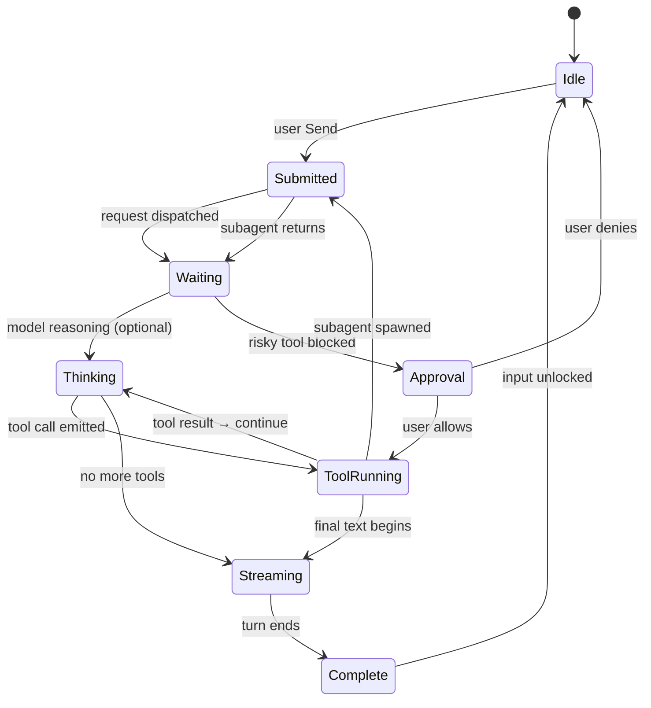

| Fase | Input user | Visual di chat | Shimmer? |
|------|------------|----------------|----------|
| **Idle** | Enabled | Turn sebelumnya utuh | Tidak |
| **Submitted** | Disabled / Send greyed | — | Tidak |
| **Waiting** | Disabled | Placeholder assistant block kosong | **Ya — full block** |
| **Thinking** | Disabled | Collapsible thinking block (jika enabled) | **Ya — border/isi** |
| **ToolRunning** | Disabled | Tool card muncul (collapsed default) | Spinner icon, bukan shimmer |
| **Streaming** | Disabled (Stop enabled) | Markdown append live | **Tidak** pada teks |
| **Approval** | Partial | Approval card | Tidak |
| **Complete** | Enabled | Blok final statis | Tidak |

#### 5.9.3 Stream — Tipe Konten yang Mengalir

Urutan tipikal dalam satu turn (bisa berulang tool ↔ thinking):

| # | Tipe event | Cara render | Stream behavior |
|---|------------|-------------|-----------------|
| 1 | `thinking` | Block tertiary, collapsible | Token stream internal; UI update batch ~50–100ms |
| 2 | `tool_call` | Card dengan nama tool + arg summary | Muncul sekali; args bisa stream untuk tool besar |
| 3 | `tool_result` | Collapsed dalam card; expand on click | Blob sekali (file content, shell output) |
| 4 | `text_delta` | Markdown paragraph | **Append per delta** — no per-char animation |
| 5 | `approval_request` | Card kuning sticky | Interrupt stream sampai user action |
| 6 | `subagent` | Purple badge + status line | Nested; tidak buka tab baru |
| 7 | `error` | Inline error bar orange | Menghentikan stream turn |

**Prinsip stream teks:**
- Teks **ditambahkan** ke DOM, bukan di-retype
- Markdown di-parse incremental (heading, code fence, list)
- Code block: tunggu fence closing ` ``` ` sebelum apply highlight penuh
- Link & citation: resolve setelah chunk cukup
- **Tidak ada** cursor berkedip di akhir kalimat
- Scroll: auto hanya jika user di bottom (§9.3)

#### 5.9.4 Shimmer — Kapan & Bagaimana

Shimmer = indikator **"agent bekerja, belum ada konten final"**. Hanya dipakai saat **belum ada teks/tool yang bisa ditampilkan**.

##### A. Pre-first-token shimmer (Waiting)

Muncul setelah Send, sebelum event pertama tiba.

```
┌─────────────────────────────────────────────┐
│  ░░░░░░░░░░░░░░░░░░░░░░░░░░░░░░░░░░░░░░░░  │  ← shimmer bar
│  ░░░░░░░░░░░░░░░░░░░                         │
└─────────────────────────────────────────────┘
```

| Property | Nilai |
|----------|-------|
| Trigger | `Submitted` → belum ada `thinking` / `tool` / `text` |
| Durasi | Sampai event pertama (biasanya 200ms–3s) |
| Motion | `fillQuaternary` → `fillTertiary` sweep kiri→kanan |
| Period | 1.2s loop, `ease-in-out` |
| Height | ~40px (2 baris body text) |
| Gradient | **Satu-satunya exception**: sweep horizontal sangat subtle dalam token opacity — bukan rainbow gradient |

##### B. Thinking shimmer (aktif)

Saat model reasoning dan `showThinkingBlocks: true` (CLI default: **false** — thinking sering disembunyikan).

```
┌─ Thinking ──────────────────────────────────┐
│ ▌░░ reasoning content streaming... ░░        │  ← left border pulse
└─────────────────────────────────────────────┘
```

| Property | Nilai |
|----------|-------|
| Trigger | Thinking tokens aktif |
| Border kiri | 2px `foregroundTertiary`, opacity pulse 0.3↔0.6, 1.5s |
| Background | `fillQuaternary` static |
| Teks | `foregroundTertiary`, stream batch |
| Collapse | Saat thinking selesai → ringkas 1 baris summary, 200ms ease-in |
| Setting | Cursor Settings / `cli-config.json` → `display.showThinkingBlocks` |

Jika thinking **disabled**: user hanya melihat pre-first-token shimmer (A), lalu langsung tool atau teks — thinking tetap jalan di belakang, tidak dirender.

##### C. Status line shimmer — "Planning next moves"

Bukan shimmer bar penuh; **dot pulse** di status strip bawah chat.

```
Planning next moves  ● ○ ○     →     ● ● ○     →     ● ● ●
```

| Property | Nilai |
|----------|-------|
| Trigger | Agent dalam tool loop, belum emit text |
| Dots | 3 buah, 6px, `foregroundTertiary` |
| Stagger | 200ms per dot, opacity 0.3→1 |
| Loop | 600ms total |
| Setting | `display.showStatusIndicators` (CLI, default false) |

##### D. Tool executing — spinner, bukan shimmer

Tool call **tidak** pakai shimmer — pakai spinner 16px + label.

```
⟳ Reading file...        →    ✓ Read lib.rs (120 lines)
```

| State | Visual | Motion |
|-------|--------|--------|
| Running | Spinner + tool name `foregroundSecondary` | Rotate 800ms linear ∞ |
| Success | Checkmark green + summary collapsed | Fade swap 100ms |
| Failed | X orange + error excerpt expanded | Expand 200ms auto |

##### E. Subagent shimmer

```
🟣 explore — searching codebase...  ░░░░░░░
```

| Property | Nilai |
|----------|-------|
| Badge | Purple `category.purple`, static |
| Progress | Thin 2px bar bawah badge, `accent` fill indeterminate |
| Teks status | `small` typography, tertiary |
| Selesai | Badge ✓, bar hilang 150ms fade |

##### F. Cloud agent thumbnail shimmer

Khusus sidebar cloud agent — bukan chat stream.

| Property | Nilai |
|----------|-------|
| Slot | 48×36px di sidebar item |
| Placeholder | `fillTertiary` + horizontal sweep 1.5s |
| Ready | Screenshot fade-in 200ms, replace placeholder |

#### 5.9.5 Stream Multi-Blok dalam Satu Turn

Contoh urutan visual user saat agent fix bug:

```
[User]  perbaiki bug login

        ░░░ shimmer (waiting) ░░░           ← 0.3s

        ▸ Read 1 file · Grep 1 pattern      ← tool group collapsed, 150ms slide-in

        [markdown stream]
        Saya menemukan masalah di...        ← text_delta append, no shimmer

        ▸ Shell 1 command                   ← tool lagi

        ┌─ ⚠ Approval ─────────────────┐
        │ cargo test -p oxide-core      │   ← stream PAUSE
        └───────────────────────────────┘

        [markdown stream]
        Test sudah hijau. Patch:            ← resume setelah approve

        ─── turn complete ───
```

**Aturan pause stream:**
- Approval → hard pause sampai user klik
- User scroll up → auto-scroll pause, stream tetap jalan
- User klik **Stop** → stream abort, partial message tetap + label "Stopped"

#### 5.9.6 Stop, Retry & Error

| Aksi | Efek stream | Visual |
|------|-------------|--------|
| **Stop** (`Esc` / Stop button) | Abort SSE; partial text saved | "Stopped" badge `small` tertiary |
| **Retry** | Resend last user turn | Chat rewind ke user message, shimmer (A) lagi |
| **Error model** | Stream end | Orange bar: error message, retry button |
| **Error tool** | Continue atau stop | Tool card expanded orange, agent bisa recover |

Stop button: visible hanya fase `Waiting` → `Streaming`; hilang 100ms fade di `Complete`.

#### 5.9.7 Perbedaan Stream: Agent Mode vs Mode Lain

| Aspek | Agent | Plan | Ask | Debug |
|-------|-------|------|-----|-------|
| Tool calls | Ya, collapsed | Tidak | Tidak | Ya, verbose |
| Shimmer waiting | Ya | Ya | Ya | Ya |
| Thinking block | Model-dependent | Sama | Sama | Often expanded |
| Approval cards | Ya | Tidak | Tidak | Ya |
| Auto-scroll | Ya | Ya | Ya | Ya |
| Diffs auto-open | Ya (on write) | Tidak | Tidak | Ya |
| Subagent stream | Ya | Tidak | Tidak | Ya |

#### 5.9.8 Pengaturan yang Mempengaruhi Stream UI

| Setting | Lokasi | Default | Efek |
|---------|--------|---------|------|
| `showThinkingBlocks` | CLI `display` / Settings | `false` | Tampilkan thinking + shimmer (B) |
| `showStatusIndicators` | CLI `display` | `false` | Dot pulse "Planning..." (C) |
| `useHttp1ForAgent` | CLI `network` | `false` | SSE streaming transport |
| Approval mode | Settings → Agents | allowlist | Frekuensi stream pause |
| Model picker | Input bar | varies | Thinking-capable models → lebih sering (B) |

#### 5.9.9 Inti Program Agent (dari dalam)

Ringkasan **apa agent benar-benar lakukan** tiap turn — menjelaskan mengapa shimmer/stream terlihat seperti itu:

```
1. TERIMA konteks
   └── rules, skills, git status, open files, terminal, history

2. PLAN (internal / thinking stream)
   └── pecah task, pilih tools — UI: shimmer atau thinking block

3. LOOP tool-use
   ├── emit tool_call  → UI: spinner card
   ├── tunggu result   → UI: card update
   ├── approval gate   → UI: PAUSE + card
   └── subagent?       → UI: purple badge stream

4. EMIT text_delta
   └── jawaban final markdown — UI: append, no shimmer

5. SELESAI
   └── unlock input, sidebar status idle, diffs debounce open
```

Agent **tidak** mengirim instruksi animasi. Agent mengirim **event**; Cursor client memetakan:

| Event agent | Respons UI |
|-------------|------------|
| Belum ada event | Shimmer (A) |
| Thinking tokens | Shimmer (B) atau hidden |
| `tool_call` | Spinner card |
| `text_delta` | Markdown append |
| `approval` | Pause + card |
| Turn end | Stop shimmer semua |

#### 5.9.10 Do & Don't — Stream UX Agent

| Do | Don't |
|----|-------|
| Biarkan tool calls collapsed | Expand semua tool manual |
| Scroll ke bawah untuk auto-follow | Fight auto-scroll saat ingin baca |
| Stop jika salah arah | Tunggu turn panjang selesai |
| Enable thinking jika debug reasoning | Biarkan thinking on untuk daily driver |
| Satu task per turn panjang | Campur 5 task dalam satu prompt |

---

## 6. Animasi & Motion

> Catatan: Cursor tidak mempublikasikan motion spec formal. Bagian ini merangkum pola yang diamati dari produk + konvensi design system internal. Nilai duration/easing bersifat **inferensi** kecuali disebutkan eksplisit.

### 6.1 Prinsip Motion

1. **Fast & functional** — animasi melayani orientasi, bukan dekorasi
2. **Subtle** — opacity & translate kecil, bukan bounce/elastic
3. **Interruptible** — user bisa klik/tab sebelum animasi selesai
4. **Reduced motion** — respect `prefers-reduced-motion: reduce`

### 6.2 Duration Scale

| Token | Duration | Penggunaan |
|-------|----------|------------|
| `instant` | 0ms | Toggle checkbox, instant feedback |
| `fast` | 100ms | Hover bg, focus ring |
| `normal` | 150ms | Tab switch, sidebar item select |
| `moderate` | 200ms | Panel collapse, dropdown open |
| `slow` | 300ms | Window transition (Agents ↔ Editor) |
| `deliberate` | 400ms | Cloud handoff, large layout shift |

### 6.3 Easing Curves

| Nama | CSS | Penggunaan |
|------|-----|------------|
| `ease-out` | `cubic-bezier(0, 0, 0.2, 1)` | Enter (panel muncul) |
| `ease-in` | `cubic-bezier(0.4, 0, 1, 1)` | Exit (panel hilang) |
| `ease-in-out` | `cubic-bezier(0.4, 0, 0.2, 1)` | Layout resize, tab switch |
| `spring-lite` | `cubic-bezier(0.34, 1.2, 0.64, 1)` | Status dot pulse (subtle overshoot) |

### 6.4 Animasi per Komponen

#### A. Window Transition (Agents ↔ Editor)

```
Trigger: Cmd+Shift+P → Open Agents/Editor Window
Duration: 300ms
Easing: ease-in-out
Property: opacity 0→1, subtle scale 0.98→1.0
```

Tidak ada slide penuh — crossfade dengan micro-scale agar terasa "glass" (codename).

#### B. Agent Sidebar — Item Select

```
Trigger: Click agent item
Duration: 150ms
Easing: ease-out
Properties:
  - background-color: transparent → fillSecondary
  - border-left-width: 0 → 2px (accent)
  - previous item: reverse simultaneously
```

#### C. Agent Sidebar — Status Pulse (Running)

```
Trigger: Agent state = running
Duration: 2000ms loop
Easing: ease-in-out
Property: opacity 1 → 0.5 → 1 on status dot
```

Cloud agent idle: no pulse. Waiting approval: yellow pulse, 1500ms loop.

#### D. Agent Tab Switch

```
Trigger: Click tab / keyboard shortcut
Duration: 150ms
Easing: ease-in-out
Properties:
  - active indicator (bottom border): translateX from previous tab
  - content: opacity crossfade 0.7→1 (no slide)
```

Grid layout: tiles resize dengan `ease-in-out` 200ms.

#### E. Tool Call Expand/Collapse

```
Trigger: Click chevron on tool group
Duration: 200ms
Easing: ease-out
Properties:
  - max-height: 0 → auto (measured)
  - chevron rotate: 0° → 90°
  - opacity children: 0 → 1 (delay 50ms)
```

Default state: **collapsed** — animasi expand memberi sense of "digging deeper".

#### F. Chat Message Stream

> Detail lengkap: **§5.9.3–5.9.5**

```
Trigger: New assistant token / block
Duration: instant (no per-token animation)
Exception: New tool call group slides in:
  - translateY: 8px → 0
  - opacity: 0 → 1
  - duration: 150ms ease-out
```

Streaming text: no typewriter effect — plain append, native scroll.

#### G. Thinking Block & Shimmer

> Detail lengkap: **§5.9.4 (A–F)**

```
Trigger: Thinking starts
Duration: fade-in 100ms
During: subtle shimmer on left border (opacity pulse 0.3→0.6, 1.5s loop)
Trigger end: collapse to single line summary, 200ms ease-in
Pre-first-token: full-block shimmer (§5.9.4-A) sebelum event apapun
```

#### H. Secondary Panel (Diffs / Browser / Canvas)

```
Trigger: Open panel / drag resize handle
Duration: 200ms
Easing: ease-out
Properties:
  - width: 0 → target (320–480px)
  - opacity: 0 → 1
  - main panel: flex-shrink simultaneously
```

Collapse: 150ms ease-in, reverse.

#### I. Diffs — File List Update

```
Trigger: Agent writes new file
Duration: 150ms per item (stagger 30ms)
Easing: ease-out
Properties:
  - new row: translateX -8px → 0, opacity 0 → 1
  - flash highlight: fillPrimary fade 300ms
```

#### J. Approval Card

```
Trigger: Agent requests approval
Duration: 200ms
Easing: spring-lite
Properties:
  - translateY: 16px → 0
  - opacity: 0 → 1
  - scale: 0.96 → 1.0
```

Dismiss (after action): 150ms ease-in, reverse.

#### K. Cloud ↔ Local Handoff

```
Trigger: Click "Move to Cloud" / "Move to Local"
Duration: 400ms (documented as "really fast" — perceived < 500ms)
Easing: ease-in-out
Properties:
  - agent item: brief accent glow (box-shadow tidak — gunakan fillPrimary pulse)
  - badge transition: "local" ↔ "cloud" crossfade
  - thumbnail slot: fade in when cloud screenshot ready
```

#### L. Design Mode Overlay

```
Trigger: Cmd+Shift+D
Duration: 150ms
Easing: ease-out
Properties:
  - overlay opacity: 0 → 1
  - crosshair cursor: instant
  - selection box: draw on drag (no animation until release)
  - on release: selection box snaps with 100ms ease-out
```

Design sidebar slide: 200ms from right edge.

#### M. Browser — Apply Changes

```
Trigger: Click Apply in Design sidebar
Duration: 300ms total
Sequence:
  1. Apply button → loading spinner (instant)
  2. Agent processes (no UI animation)
  3. Hot-reload: page flash subtle (browser native)
  4. Success: green checkmark fade-in 150ms
```

#### N. Canvas Open

```
Trigger: Agent creates .canvas.tsx
Duration: 200ms
Easing: ease-out
Properties:
  - panel width expand (same as secondary panel)
  - canvas content: opacity 0 → 1, no skeleton if data ready
```

#### O. Input Area — Auto-grow

```
Trigger: Text exceeds single line
Duration: 100ms
Easing: ease-out
Property: height (measured line count × line-height)
```

#### P. Send Button

```
Trigger: Hover / click
Hover: background buttonHover, 100ms ease
Active: scale 0.97, 50ms ease-in
Disabled: opacity 0.4, no animation
```

### 6.5 Loading & Progress States

| State | Visual | Motion |
|-------|--------|--------|
| Agent thinking | "Planning next moves" text + subtle dot pulse | 3 dots, 600ms stagger loop |
| Tool executing | Spinner 16px + tool name | Rotate 800ms linear infinite |
| Cloud agent | Thumbnail placeholder shimmer | Horizontal gradient sweep 1.5s (subtle, within token) |
| Build/test | Terminal output stream | Native scroll, no animation |
| PR creating | Progress bar 2px height, accent fill | Width 0→100%, indeterminate if unknown |

### 6.6 Reduced Motion Fallback

Saat `prefers-reduced-motion: reduce`:

- Semua duration → 0ms atau max 50ms
- Pulse/shimmer → static color
- Panel transition → instant show/hide
- Tab indicator → instant jump, no slide

---

## 7. Fitur Lengkap Cursor 3.0

Ringkasan semua kapabilitas yang tersedia di ekosistem Agents Window — dikelompokkan supaya mudah dipetakan ke zona UI.

### 7.1 Katalog Fitur per Kategori

#### A. Agent Core (inti)

| Fitur | Deskripsi | Di mana di UI |
|-------|-----------|---------------|
| **Agent Modes** | Agent (full write), Plan (read-only), Debug (troubleshoot), Ask (eksplorasi) | Input bar → mode picker |
| **Multi-turn chat** | Percakapan berkelanjutan dengan memori sesi | Main panel — chat stream |
| **Tool execution** | Read, Write, Shell, Grep, Search, Web, Git, dll. | Collapsed tool blocks di chat |
| **Streaming response** | Token-by-token output tanpa typewriter effect | Chat stream |
| **Thinking blocks** | Reasoning collapsible | Chat stream, tertiary color |
| **Approval flow** | Konfirmasi shell, MCP, smart mode | Approval card inline |
| **Subagents** | explore, shell, bugbot, security-review, ci-investigator | Purple badge + progress |
| **@ mentions** | File, folder, docs, browser, MCP server | Input `@` picker |

#### B. Parallel & Multi-Environment

| Fitur | Deskripsi | Di mana di UI |
|-------|-----------|---------------|
| **Agent Tabs** | Banyak chat independen, split/grid | Main panel tab bar |
| **Agent Sidebar** | Semua agent local + cloud + eksternal | Sidebar kiri |
| **Local agents** | Jalan di mesin user, akses filesystem penuh | Badge `local`, dot hijau |
| **Cloud agents** | Jalan di VM Cursor, lanjut saat laptop tutup | Badge `cloud`, thumbnail |
| **Remote SSH** | Agent di server remote | Badge `ssh` |
| **Local ↔ Cloud handoff** | Pindah sesi cepat antar environment | Context menu / handoff button |
| **Multi-workspace** | Satu window, banyak repo | Chrome bar workspace switcher |
| **Worktrees** | Git checkout terisolasi per agent/task | `/worktree`, `/best-of-n` (editor) |

#### C. Sumber Agent Eksternal

Agent yang dimulai di luar desktop tetap muncul di sidebar:

| Sumber | Trigger | Badge |
|--------|---------|-------|
| Desktop app | User buat manual | `local` / `cloud` |
| Mobile / Web | cursor.com/agents | `cloud` |
| Slack | Mention / command | `slack` (pink) |
| GitHub | PR comment, issue | `github` |
| Linear | Task assignment | `linear` |

#### D. Review & Git Workflow

| Fitur | Deskripsi | Di mana di UI |
|-------|-----------|---------------|
| **Diffs view** | Review perubahan simplified | Secondary panel |
| **Inline diff edit** | Edit langsung di diff | Diffs panel |
| **Stage / Commit** | Git tanpa keluar Cursor | Diffs footer actions |
| **Create PR** | Buat PR dari diff | Diffs footer |
| **PR Page** | Review PR, Bugbot, Code Tour, inline comment | Browser / dedicated view |
| **Bugbot** | Auto-review, suggested fix one-click | PR page inline |
| **Code Tour** | Walkthrough naratif perubahan | PR page |

#### E. Browser & Design

| Fitur | Deskripsi | Di mana di UI |
|-------|-----------|---------------|
| **Integrated browser** | Pane inline, bukan window terpisah | Secondary panel |
| **Navigate / Click / Type / Scroll** | Agent kontrol browser via MCP | Tool blocks + browser pane |
| **Screenshot** | Visual feedback ke agent | Chat images + file read |
| **Console & network** | Debug via log files (grep selective) | Agent tools |
| **Session persistence** | Cookies, localStorage, IndexedDB per workspace | Otomatis |
| **Design Mode** | Annotate & select UI elements | `Cmd+Shift+D` overlay |
| **Design sidebar** | Layout, dimension, color, appearance sliders | Browser panel kanan |
| **Apply to code** | Visual change → agent → codebase | Apply button |
| **Multi-element parallel** | Beberapa agent edit elemen berbeda sekaligus | Design sidebar |

#### F. Canvas & Visual Output

| Fitur | Deskripsi | Di mana di UI |
|-------|-----------|---------------|
| **Canvas panel** | React live artifact di samping chat | Secondary panel |
| **Charts / tables / diagrams** | Data-heavy deliverable | `.canvas.tsx` |
| **DiffView component** | Diff visual dalam canvas | Canvas SDK |
| **Theme sync** | `useHostTheme()` ikut dark/light Cursor | Otomatis |

#### G. Extensibility

| Fitur | Deskripsi | Lokasi config |
|-------|-----------|---------------|
| **Rules** | Instruksi persisten per project/glob | `.cursor/rules/*.mdc`, `AGENTS.md` |
| **Skills** | Workflow khusus per task | `~/.cursor/skills/`, `.cursor/skills/` |
| **Hooks** | Script sebelum/sesudah event agent | `.cursor/hooks.json` |
| **MCP servers** | Tools eksternal (Linear, Slack, DB, dll.) | Dashboard + `mcp.json` |
| **Plugins (Marketplace)** | MCP + skills + subagents one-click | Marketplace panel |
| **Team marketplace** | Plugin private per organisasi | Enterprise settings |
| **Custom subagents** | Agent spesialis user-defined | `.cursor/agents/` |
| **Automations** | Agent terjadwal (cron, git, Slack) | Automations editor |
| **Cursor SDK** | Agent programmatic (TS/Python) | `@cursor/sdk`, `cursor-sdk` |

#### H. Models & Intelligence

| Fitur | Deskripsi | Di mana di UI |
|-------|-----------|---------------|
| **Composer 2** | Model frontier Cursor, limit tinggi | Model picker |
| **Third-party models** | GPT, Claude, Auto, dll. | Model picker |
| **Multi-LLM compare** | Prompt sama → beberapa model paralel | Shortcut khusus |
| **Auto model** | Cursor pilih model otomatis | Model picker → Auto |

#### I. Security & Enterprise

| Fitur | Deskripsi |
|-------|-----------|
| **Sandbox shell** | Command default restricted |
| **Approval policies** | Allow once / always / deny |
| **Browser tool approval** | Manual / allow-list / auto-run |
| **MCP allowlist/denylist** | Enterprise gate per server |
| **Browser origin allowlist** | Batasi URL agent bisa navigate |
| **Smart mode approval** | Classifier block → native approval card |
| **Display agent summary toggle** | Sembunyikan diff/code di sidebar eksternal |

#### J. CLI & Status

| Fitur | Deskripsi |
|-------|-----------|
| **Cursor CLI** | Agent dari terminal |
| **Custom status line** | Command bar di atas prompt (`~/.cursor/cli-config.json`) |
| **Loop command** | `/loop 5m <prompt>` recurring local work |

### 7.2 Fitur Eksklusif Agents Window vs Editor

| Hanya di Agents Window | Hanya / lebih baik di Editor |
|------------------------|------------------------------|
| Multi-agent sidebar unified | VS Code extensions penuh |
| Cloud agent management | Flexible multi-file split |
| New diffs view + PR flow | Worktree dropdown legacy → `/worktree` |
| Design Mode + browser pane | Deep file tree navigation |
| Multi-repo dari satu window | Traditional SCM panel |
| Cloud ↔ local handoff UX | Inline Edit (Tab) |

### 7.3 Matriks Fitur → Panel

```
SIDEBAR          MAIN PANEL         SECONDARY PANEL
────────         ──────────         ───────────────
Agent list   →   Active chat    →   Diffs (default saat agent edit)
Cloud thumb  →   Tool stream    →   Browser (saat @browser / dev)
Ext. badges  →   Input/mode     →   Canvas (saat artifact)
Handoff      →   Approval cards →   Design sidebar (Design Mode)
               Subagent progress→   File viewer (Cmd+P deep dive)
```

---

## 8. Arsitektur Informasi & Organisasi UI

Bagaimana Cursor mengatur banyak fitur agar tidak overwhelming — prinsip **progressive disclosure**.

### 8.1 Hierarki Informasi (3 lapisan)

```
LAPISAN 1 — SELALU TERLIHAT (glanceable)
├── Agent sidebar: siapa aktif, status apa
├── Tab aktif: nama task
└── Input bar: mode + model

LAPISAN 2 — KONTEKSTUAL (muncul saat relevan)
├── Secondary panel: diffs setelah edit, browser saat web task
├── Approval card: saat butuh konfirmasi
└── Thinking block: saat agent reasoning

LAPISAN 3 — ON-DEMAND (user buka manual)
├── Tool call expanded: klik chevron
├── File viewer / LSP: Cmd+P
├── Editor Window: Cmd+Shift+P
└── Settings / Marketplace / Automations
```

**Aturan emas:** user di lapisan 1 melihat **outcome** (agent jalan, ada perubahan). Detail mekanis (tool call, log) tersembunyi sampai diminta.

### 8.2 Zoning Rules — Apa di Mana

| Zona | Prioritas konten | Max density |
|------|------------------|-------------|
| Sidebar | Nama, status, env — **bukan** chat preview | 1 baris title + 1 baris meta |
| Main chat | Narasi + hasil — tool calls collapsed | Scroll vertikal, no horizontal |
| Secondary | Satu mode aktif: diff ATAU browser ATAU canvas | Split internal boleh, no triple stack |
| Chrome | Workspace, global search, panel toggles | Max 5–7 icon groups |
| Input | Prompt + 2 dropdown (mode, model) + 3 actions | Single row controls |

### 8.3 Panel State Machine

Secondary panel punya **satu state aktif** — switching smooth, tidak menumpuk:

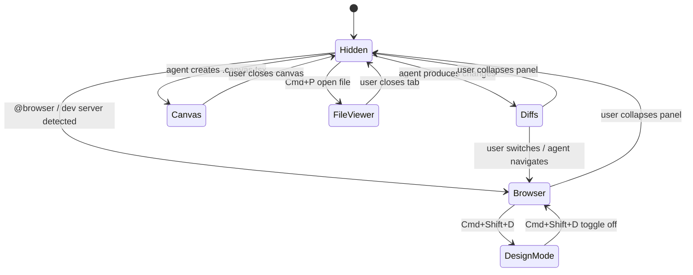

Transisi antar state: **200ms width + opacity** (lihat §6.4-H). Panel lama fade-out sementara panel baru fade-in — tidak slide-over (menghindari motion sickness).

### 8.4 Density Modes (inferensi)

| Mode | Sidebar | Tool calls | Secondary |
|------|---------|------------|-----------|
| **Focus** (default) | Compact list | Collapsed | Auto-open diffs only |
| **Inspect** | + thumbnail | Expanded on click | Browser + console |
| **Orchestrate** | Full + filters | Collapsed | Hidden — maximize tab grid |

User tidak perlu setting manual — mode bergeser otomatis berdasarkan aksi (agent edit → diffs; `@browser` → browser pane).

### 8.5 Naming & Labeling

Konsistensi label mengurangi cognitive load:

| Konteks | Format | Contoh |
|---------|--------|--------|
| Agent tab | `verb-noun` atau issue ID | `fix-auth-bug`, `OX-142` |
| Sidebar meta | `repo · time · state` | `oxide · 2m · running` |
| Env badge | lowercase singkat | `local`, `cloud`, `slack` |
| Tool summary | `count + type` | `Read 3 files` |
| Diff file row | git status letter + path | `M  src/lib.rs` |

---

## 9. Alur UX & Transisi Smooth

### 9.1 User Journey — Siklus Kerja Utama

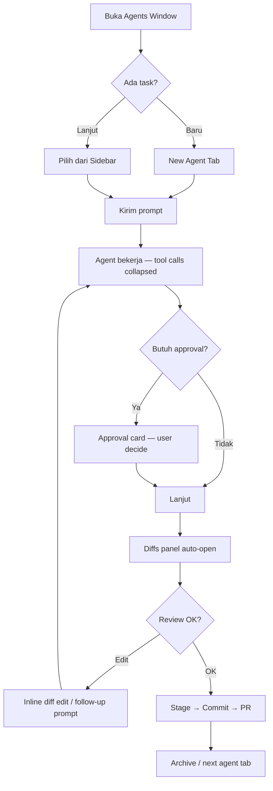

Setiap panah = transisi dengan animasi ≤300ms. Tidak ada modal blocking kecuali approval.

### 9.2 Transisi Antar Konteks — Cheat Sheet

| Dari → Ke | Trigger | Animasi | Durasi |
|-----------|---------|---------|--------|
| Editor → Agents Window | `Cmd+Shift+P` | Crossfade + scale 0.98→1 | 300ms |
| Agent A → Agent B | Sidebar click | Tab indicator slide + content fade | 150ms |
| Chat → Diffs | Auto (agent edit) | Panel expand kanan | 200ms |
| Chat → Browser | `@browser` / dev detect | Panel expand + URL bar fade-in | 200ms |
| Browser → Design Mode | `Cmd+Shift+D` | Overlay fade + sidebar slide | 150+200ms |
| Local → Cloud | Handoff button | Badge crossfade + thumbnail slot | 400ms |
| Parallel grid → Single | Close tabs | Grid resize ease-in-out | 200ms |

### 9.3 Scroll & Focus Behavior

| Area | Auto-scroll? | Behavior |
|------|--------------|----------|
| Chat stream | Ya, saat user di bottom | Smooth scroll 100ms; pause jika user scroll up |
| Diffs file list | Tidak | User-controlled; new file flash highlight |
| Sidebar | Tidak | Selected item scroll into view 150ms |
| Browser | Agent-controlled | Scroll to element before click |
| Terminal strip | Ya, tail mode | Instant append |

**Focus management:** setelah approval action, focus kembali ke input (150ms delay agar card dismiss selesai). Tab switch tidak steal focus dari input jika user sedang mengetik.

### 9.4 Error & Empty States

| State | Visual | Motion |
|-------|--------|--------|
| No agents yet | Sidebar: CTA "New Agent" centered | Fade-in 200ms on first open |
| Agent failed | Orange border-left + error summary di chat | Shake tidak dipakai — static orange |
| Empty diff | "No changes yet" tertiary text | No animation |
| Browser load fail | Inline error bar, `strokeSecondary` border | Slide down 150ms |
| Network offline (cloud) | Cloud badge → gray + tooltip | Badge crossfade 200ms |

Tidak ada empty state decorative — sesuai prinsip Canvas: **omit, don't placeholder**.

### 9.5 Notifikasi & Attention

Prioritas notifikasi (hanya satu channel aktif per prioritas):

1. **Approval required** — inline card (bukan toast)
2. **Agent complete** — sidebar status dot stop pulse + subtle sound (opsional)
3. **Cloud screenshot ready** — thumbnail fade-in di sidebar
4. **Background agent** — badge count di sidebar section header

Tidak memakai toast stack — menghindari notifikasi menumpuk.

---

## 10. Panduan Workflow — Atur Semuanya dengan Rapi

Praktik mengorganisir Agents Window supaya produktif dan tidak chaos.

### 10.1 Prinsip Organisasi

1. **Satu tab = satu task** — jangan campur "fix bug" dan "refactor API" dalam satu chat
2. **Naming konsisten** — rename tab segera setelah buat (`fix-login-session`)
3. **Sidebar sebagai dashboard** — scan status tanpa buka tiap tab
4. **Secondary panel tunggal** — biarkan auto-switch; jangan buka diff + browser manual bersamaan
5. **Handoff disiplin** — local untuk iterasi cepat; cloud untuk task panjang overnight
6. **Archive selesai** — agent done → archive dari sidebar, jangan biarkan list membesar

### 10.2 Template Setup per Tipe Task

#### Bug fix (cepat, local)

```
Tab:       fix-[bug-name]
Mode:      Agent
Model:     Composer 2 (fast iteration)
Panel:     Diffs auto → review → commit
Worktree:  Tidak perlu (branch kecil)
```

#### Feature besar (paralel)

```
Tab 1:     feat-[name]-backend   (local, worktree)
Tab 2:     feat-[name]-frontend  (local, worktree lain)
Tab 3:     feat-[name]-tests     (cloud, overnight)
Panel:     Grid 2-col untuk Tab 1+2; cloud di sidebar only
```

#### Frontend / UI (Design Mode)

```
Tab:       ui-[component]
Mode:      Agent
Panel:     Browser + Design Mode
Flow:      Buka localhost → Design Mode → select → prompt → Apply → verify
```

#### PR review

```
Tab:       review-pr-[number]
Mode:      Ask atau Agent
Panel:     PR Page atau Diffs
Flow:      Bugbot findings → one-click fix → push → re-review
```

### 10.3 Parallel Agent Limits (rekomendasi)

| Setup | Max parallel local | Max cloud | Catatan |
|-------|-------------------|-----------|---------|
| Laptop 16GB | 2–3 | 1–2 | Watch CPU/RAM |
| Desktop 32GB+ | 4–6 | 3–5 | Grid 2×2 nyaman |
| Overnight | 0 local | 3+ | Cloud handoff semua |

Lebih dari 6 agent di sidebar = diminishing returns — cognitive overload.

### 10.4 Panel Layout Recipes

**Recipe A — Coding default (≥1440px)**

```
[Sidebar 260px] [Chat flex-1] [Diffs 400px]
```

**Recipe B — Frontend**

```
[Sidebar 240px] [Chat 40%] [Browser 60%]
```

**Recipe C — Orchestration (banyak agent, sedikit review)**

```
[Sidebar 280px] [Grid 2×2 tabs 100%] [Panel hidden]
```

**Recipe D — Review only**

```
[Sidebar 200px] [Diffs 50%] [Chat 50%]
```

Switch recipe: drag resize handle — animasi 200ms, posisi diingat per workspace.

### 10.5 Context Hygiene — Agar Agent Tidak "Bingung"

| Praktik | Kenapa |
|---------|--------|
| `@file` hanya file relevan | Kurangi noise context |
| Rules di `.cursor/rules/` | Agent konsisten tanpa ulang instruksi |
| `AGENTS.md` untuk project-wide | Build/test conventions |
| Tutup tab selesai | Hindari context bleed |
| Worktree per feature | Isolasi diff antar agent |
| Commit message jelas | Agent lanjutan paham history |

### 10.6 Integrasi Eksternal — Alur Smooth

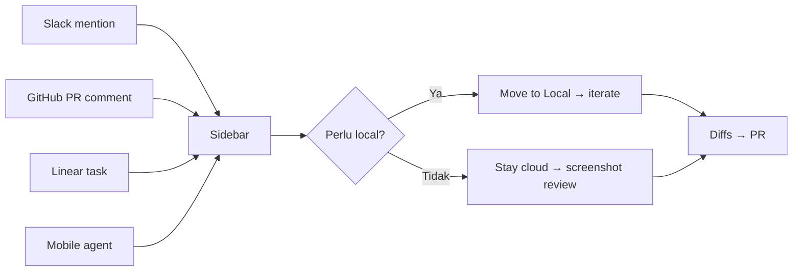

Semua sumber converge ke **satu sidebar** — user tidak perlu cek 4 app berbeda.

### 10.7 Daily Rhythm (contoh)

| Waktu | Aktivitas | Layout |
|-------|-----------|--------|
| Pagi | Plan mode — breakdown task | Single tab, no panel |
| Siang | 2–3 parallel local agents | Grid + sidebar |
| Sore | Review diffs, commit, PR | Diffs panel dominant |
| Malam | Handoff ke cloud | Sidebar monitor, laptop tutup |

---

## 11. Orkestrasi Agent — Mengapa Terasa Smooth

Bagian ini menjelaskan **bagaimana sistem mengatur kompleksitas di belakang layar** — sehingga UI terasa sederhana meski banyak fitur.

### 11.1 Progressive Disclosure Pipeline

```
User prompt
    ↓
[Context engine] — inject rules, git, open files, skills
    ↓
[Planner] — pecah task (internal, tidak selalu visible)
    ↓
[Tool loop] — read → act → verify
    ↓
[UI renderer] — collapse tools, show outcome
    ↓
[Panel controller] — auto-open diffs/browser/canvas
    ↓
User sees: clean narrative + diff panel
```

User hanya melihat 2–3 lapisan terakhir kecuali mereka expand.

### 11.2 Tool Call Grouping Logic

Alih-alih 15 baris tool log, UI merangkum:

```
▸ Read 3 files · Grep 2 patterns · Shell 1 command
```

**Grouping rules:**
- Same-type tools dalam 30s window → satu grup
- Grup diurutkan kronologis
- Error dalam grup → expand otomatis + red indicator
- Success → tetap collapsed

Ini mengurangi **visual jitter** saat agent busy.

### 11.3 Panel Auto-Controller

| Event agent | Panel action | Delay |
|-------------|--------------|-------|
| First `Write`/`StrReplace` | Open diffs | 0ms (debounce 500ms batch) |
| `@browser` in prompt | Open browser | 100ms |
| `.canvas.tsx` created | Open canvas | 200ms |
| All tools idle 3s | No change | — |
| User manual override | Lock panel 5min | — |

Debounce 500ms pada diffs: jika agent edit 8 file cepat, panel buka sekali — bukan 8 kali flash.

### 11.4 Subagent UX

```
Main agent chat
  └─ 🟣 explore subagent — searching codebase...
       └─ (collapsed until done)
       └─ ✓ found 4 relevant files → summarized inline
```

Subagent tidak buka tab baru — hasil **merge** ke chat utama. Menghindari tab explosion.

### 11.5 Memory & Compaction (smooth panjang sesi)

| Mekanisme | Efek pada UX |
|-----------|--------------|
| Context compaction | Chat lama dirangkum — scroll tetap smooth |
| Rules/skills persistent | Agent tidak "lupa" conventions |
| Session memory | Preferensi user carry over |
| Git diff injection | Agent tahu apa yang berubah tanpa baca semua file |

User tidak melihat compaction — terjadi di `preCompact` hook / internal.

### 11.6 Approval Gating — Friction Hanya Saat Perlu

```
Risk score:
  read file     → auto
  write file    → auto (workspace bounded)
  shell safe    → auto (allowlist)
  shell risky   → approval card (200ms spring-in)
  MCP external  → approval card
  force push    → deny hard
```

Friction ditempatkan **tepat** di momen keputusan — bukan di setiap langkah.

### 11.7 Smooth Multi-Agent Coordination

| Scenario | Strategi |
|----------|----------|
| 2 agent, 1 repo, no worktree | Serial — UI warning jika conflict |
| 2 agent, worktrees | Parallel — diffs terpisah per tab |
| Cloud + local same task | Handoff preserves full history |
| Subagent parallel | Purple badges, max 3 visible |

### 11.8 Checklist — Apakah Workflow-mu Sudah "Smooth"?

- [ ] Sidebar ≤10 agent aktif (archive sisanya)
- [ ] Setiap tab punya nama deskriptif
- [ ] Rules & `AGENTS.md` sudah setup
- [ ] Worktree untuk task paralel di repo sama
- [ ] Panel dibiarkan auto-switch (tidak manual override terus)
- [ ] Cloud untuk task >30 menit; local untuk iterasi
- [ ] Approval policy sudah dikonfigurasi (tidak kaget tiap shell)
- [ ] Design Mode untuk UI; bukan deskripsi panjang di chat
- [ ] Diffs → commit → PR dalam satu window (tidak pindah app)

---

## 12. Responsive & Layout Breakpoints

| Breakpoint | Layout |
|------------|--------|
| ≥ 1440px | Sidebar + Main + Secondary (3-column) |
| 1024–1439px | Sidebar + Main; Secondary overlay/drawer |
| < 1024px | Sidebar collapsed to icon rail; panels stack |

Secondary panel collapse: icon button di chrome bar, tooltip "Diffs" / "Browser".

---

## 13. Keyboard & Focus

### 13.1 Navigasi Window & Panel

| Shortcut | Aksi |
|----------|------|
| `Cmd+Shift+P` → Open Agents Window | Buka Glass |
| `Cmd+Shift+P` → Open Editor Window | Kembali ke IDE |
| `Cmd+P` | Quick open file (dalam Agents Window) |
| `Cmd+Shift+F` | Search across files |
| `Cmd+W` | Tutup tab agent aktif |
| `Cmd+T` | Tab agent baru |
| `Cmd+[` / `Cmd+]` | Previous / next agent tab |
| `Cmd+\` | Split tab agent |

### 13.2 Browser & Design Mode

| Shortcut | Aksi |
|----------|------|
| `Cmd+Shift+D` | Design Mode toggle |
| `Cmd+L` | Inject browser element ke chat |
| `Option+click` | Add element ke input field |
| `Shift+drag` | Area selection di browser |

### 13.3 Input & Mentions

| Shortcut | Aksi |
|----------|------|
| `@` | Mention picker (file, docs, browser, MCP) |
| `Cmd+Enter` | Send prompt |
| `Shift+Enter` | New line dalam input |
| `/` | Slash commands (`/worktree`, `/loop`, dll.) |

### 13.4 Focus

Focus ring: 1px `strokeFocused`, offset 2px, no glow.

Tab order: Sidebar → Tab bar → Chat → Secondary panel → Input.

---

## 14. Perbandingan: Composer 2.x vs Agents Window 3.0

| Aspek | Composer (2.x) | Agents Window (3.0) |
|-------|----------------|---------------------|
| Posisi | Sidebar kanan/kiri dalam IDE | Fullscreen window terpisah |
| Agent count | Satu aktif | Banyak paralel |
| Layout | Single pane chat | Tab + grid |
| Diff review | VS Code SCM panel | Built-in diffs view |
| Cloud agents | Terbatas di editor | Native di sidebar |
| Design Mode | Tidak ada | Terintegrasi browser |
| Animasi | Panel slide 200ms | Window crossfade 300ms |
| Codename | — | **Glass** |

> **Catatan:** "Composer 2" sebagai **model AI** masih ada terpisah dari perubahan UI ini.

---

## 15. Checklist Implementasi (untuk replika / mockup)

Jika membuat mockup atau komponen yang meniru Cursor 3.0:

- [ ] Background `chrome` / `sidebar` = `#141414`
- [ ] Content area `editor` = `#181818`
- [ ] Satu accent blue `#599CE7`, tidak multi-color chrome
- [ ] Hierarchy via opacity, bukan warna tambahan
- [ ] No gradients, no heavy shadows
- [ ] Tool calls collapsed by default
- [ ] Tab system seperti browser/editor tabs
- [ ] Sidebar agent list dengan status dot + env badge
- [ ] Diff colors green/red sesuai token
- [ ] Animasi 100–300ms, ease-out/in-out
- [ ] `prefers-reduced-motion` fallback
- [ ] Typography: 14px body, weight 590 untuk headings
- [ ] Border radius max `xl` (12px) untuk panel besar
- [ ] Spacing kelipatan 4px (scale di §2.2)
- [ ] Progressive disclosure: 3 lapisan informasi (§8.1)
- [ ] Secondary panel state machine — satu mode aktif (§8.3)
- [ ] Pre-first-token shimmer + thinking shimmer terpisah (§5.9.4)
- [ ] Stream pause pada approval, resume setelah action (§5.9.5)
- [ ] Tool spinner ≠ shimmer — jangan campur (§5.9.4-D)
- [ ] Tool call grouping, bukan log per-baris (§11.2)
- [ ] Panel auto-controller dengan debounce (§11.3)
- [ ] Notifikasi inline, bukan toast stack (§9.5)

---

## 17. Agent Internal UI — Anatomi & Visual Spec

> Bagian ini mendeskripsikan **tampilan internal agent** — apa yang user lihat di chat panel saat agent (Composer) bekerja. Fokus visual + animasi, bukan fitur IDE lain.

### 17.1 Pohon Komponen Chat Agent

```
CHAT COLUMN (max-width ~760px, centered)
│
├── USER TURN
│   └── Quiet block — border-left accent, bg fill 4%, no bubble tail
│
├── ASSISTANT TURN (bisa berulang dalam satu user turn)
│   ├── [Waiting]     typing dots (3×) ATAU empty + shimmer placeholder
│   ├── [Thinking]    details.thinking-box (collapsed default saat selesai)
│   ├── [Tools]       act-group collapsed ▸ "Read 3 files · Shell 1"
│   │   └── activity-card × N (inline, chrome-free)
│   ├── [Approval]    approval-card (yellow left border, pause stream)
│   ├── [Subagent]    purple inline badge + indeterminate bar
│   ├── [Text]        .agent-text.agent-md (markdown stream)
│   │   └── ::after caret ▍ saat streaming aktif
│   ├── [Diff]        details.diff-card (per file)
│   └── [Note/Error]  .note-text centered tertiary
│
├── STATUS PILL (floating, saat tool loop tanpa teks)
│   ├── .status-spinner (16px rotate)
│   └── .status-shimmer "Writing…" / "Thinking…"
│
└── COMPOSER DOCK
    ├── attach-row (images)
    ├── .composer (squircle, focus ring glow)
    └── .selectors (mode, model pills — ghost)
```

### 17.2 Spesifikasi Visual per Blok

#### User message

| Property | Cursor Glass | Catatan |
|----------|--------------|---------|
| Alignment | Start (bukan end) | Document flow, bukan chat bubble klasik |
| Background | `fillQuaternary` ~4% | `color-mix(text 4%, transparent)` |
| Accent | Border-left 2px `accent` | `#599CE7` dark |
| Radius | `sm`–`md` (6px) | Bukan 18px bubble |
| Font | 14px body | Pre-wrap |
| Max width | 720px | Sama dengan agent prose |

#### Assistant prose (streaming)

| Property | Nilai |
|----------|-------|
| Avatar | **Hidden** (Cursor 3 clean) | Logo hanya di hero/empty state |
| Font | 14–14.5px, line-height 1.7 | Prose, bukan mono |
| Max width | 720px | Readable measure |
| Markdown | Headings, lists, code fences | Syntax highlight setelah fence close |
| Caret streaming | `▍` accent, `steps(1)` 1s blink | Hanya `.streaming .row.agent:last-of-type` |
| Empty waiting | `.typing` 3 dots ATAU shimmer bars | Sebelum token pertama |

#### Thinking block

| Property | Nilai |
|----------|-------|
| Container | `details.thinking-box` | `open` saat streaming |
| Summary | "Thinking" — no emoji di Cursor asli; Oxide pakai 💭 | 12.5px `foregroundTertiary` |
| Body | Italic, pre-wrap, max-height 260px scroll | Stream `ReasoningDelta` |
| Border | Left 2px pulse saat aktif | Opacity 0.3↔0.6, 1.5s |
| Background | `fillTertiary` / elevated | Bukan border heavy |
| Selesai | Collapse ke summary satu baris | 200ms ease-in |

#### Tool / activity (collapsed group)

Cursor 3 menampilkan tools **inline minimal**, bukan card besar:

```
▸ Read 3 files · Grep 2 patterns · Shell 1 command     150ms slide-in
```

Expanded (on click):

```
▾ Read file
  · oxide-gui/src/lib.rs
▾ Shell
  · cargo build -p oxide-cli
```

| State | Icon | Label motion | Border |
|-------|------|----------------|--------|
| Running | Spinner 12px + icon | **Text shimmer** `ox-shimmer` 1.7s | None (chrome-free) |
| Done | ✓ green | Static `foregroundSecondary` | None |
| Fail | ✕ orange | `danger` color | None |

**Text shimmer CSS (activity + status):**

```css
background: linear-gradient(90deg,
  var(--muted) 0%, var(--muted) 38%,
  var(--text) 50%,
  var(--muted) 62%, var(--muted) 100%);
background-size: 220% 100%;
-webkit-background-clip: text;
background-clip: text;
color: transparent;
animation: ox-shimmer 1.7s linear infinite;
```

#### Status pill

Muncul saat `status != ""` && `streaming` — antara tool calls, sebelum teks.

| Part | Spec |
|------|------|
| Container | Pill `border-radius: 999px`, `fillSecondary` bg |
| Spinner | 13px, border 2px, top `accent`, spin 0.7s |
| Label | `status-shimmer` — same gradient text as activity |
| Position | `margin-left: 40px` → Oxide Phase 1: `8px` (no avatar offset) |
| Status strings | `"Thinking…"`, `"Writing…"`, `"Working…"` |

#### Approval card

| Property | Nilai |
|----------|-------|
| Border-left | 3px category yellow |
| Background | elevated 4% fill |
| Buttons | Deny ghost · Allow once primary · Allow always secondary |
| Motion | translateY 16px→0, 200ms spring-lite |
| Stream | **Hard pause** sampai klik |

#### Diff card

| Property | Nilai |
|----------|-------|
| Wrapper | `details.diff-card` collapsed default |
| Head | caret + path mono + `+N` `−M` counts |
| Body | Hunked lines, `.dl.add` green / `.dl.del` red |
| Enter animation | `synara-msg-in` 220ms `cubic-bezier(.22,1,.36,1)` |
| New file flash | `fillPrimary` highlight 300ms fade |

### 17.3 Urutan Render dalam DOM (penting untuk animasi)

Urutan **visual** yang user lihat (top → bottom):

1. User messages (historical)
2. Tool activities (kronologis, sebelum jawaban final)
3. Thinking box (jika ada — **di bawah** activities, di atas teks)
4. Agent markdown (jawaban)
5. Diff cards (setelah write events)
6. Status pill (sticky visual — sebenarnya di akhir scroll area, tapi muncul saat busy)

**Aturan bubble agent:** jika tool/diff muncul **setelah** bubble agent terbuka, buka **bubble baru** di bawah — supaya jawaban tidak "hilang" di atas tool cards.

### 17.4 Animasi Internal Agent — Ringkasan

| Elemen | Keyframe / transition | Duration |
|--------|----------------------|----------|
| Message row enter | `synara-msg-in` translateY 8px | 220ms |
| Typing dots | `blink` opacity | 1.3s stagger 0.18s |
| Status/activity shimmer | `ox-shimmer` bg-position | 1.7s linear ∞ |
| Spinner | `spin` rotate | 0.7s linear ∞ |
| Streaming caret | `ox-caret` steps | 1s |
| Thinking border pulse | opacity | 1.5s ∞ |
| Diff caret rotate | transform 90deg | 150ms |
| Approval enter | translateY + scale | 200ms |
| Composer focus | box-shadow ring | 180ms |
| Send button | scale 1.07 hover / 0.92 active | 160ms spring |
| Panel slide | `panel-in` translateX 14px | 180ms |
| Tab busy dot | `ox-pulse` opacity | 1.1s |

**Reduced motion:** semua ∞ animations → `none`; warna statis.

### 17.5 Token Warna — Cursor vs Oxide Saat Ini

| Role | Cursor (`cursor-dark`) | Oxide (`style.css`) | Rekomendasi Oxide |
|------|------------------------|---------------------|-------------------|
| Chrome/bg | `#141414` | `#0e0e0e` | → `#141414` |
| Sidebar | `#141414` | `#0b0b0b` | → `#141414` |
| Editor surface | `#181818` | `#181818` | ✓ sudah match |
| Text primary | `#E4E4E4` @92% | `#f5f5f5` | → `#E4E4E4EB` |
| Text muted | @55% | `#a3a3a3` | → opacity-based |
| Accent | `#599CE7` | `#6073cc` / `#6e7ff3` | → `#599CE7` |
| Diff add | `#3FA266` | `#3ad29f` | → `#3FA266` |
| Diff del | `#FC6B83` | `#fa423e` | → `#B80049` / `#FC6B83` |
| Link | `#87c3ff` | `syn-accent` | → `#87c3ff` |

### 17.6 Composer (input agent)

| Property | Cursor | Oxide (sudah ada) |
|----------|--------|-------------------|
| Shape | Rounded squircle ~19px | `.composer { border-radius: 19px }` ✓ |
| Focus ring | 3px accent @14% glow | `composer:focus-within` ✓ |
| Dock position | Bottom center, max ~760px | `.composer-dock` ✓ |
| Pills | Ghost transparent | `.pill`, `.selector` ✓ |
| Stop button | Orange saat streaming | `.send.stop` `#e0913a` — Cursor pakai accent/red |
| Attachments | Thumbnail row above | `.attach-row` ✓ |

---

## 18. Oxide Parity Guide — Samakan dengan Cursor

Panduan praktis agar **oxide-gui** terasa seperti agent Cursor. Oxide sudah punya fondasi kuat (`style.css` Phase 1–2, event loop di `lib.rs`); ini gap + prioritas.

### 18.1 Mapping Event Engine → UI

| `oxide_core::Event` | Cursor equivalent | Oxide UI saat ini | Target Cursor-like |
|---------------------|-------------------|-------------------|-------------------|
| `TurnStarted` | Submitted | `thinking` clear, status "Working…" | ✓ |
| `ReasoningDelta` | Thinking stream | `thinking-box` details | ✓ + border pulse |
| `AgentMessageDelta` | `text_delta` | append `Author::Agent` | ✓ + caret |
| `ToolCallBegin` | `tool_call` | `ActivityRow` running | Perlu **group collapse** |
| `ToolCallEnd` | `tool_result` | activity done + output | ✓ |
| `FileDiff` | diff view | `diff-card` | ✓ |
| `QuestionAsked` | approval/select | `question-card` | ✓ |
| `Error` | error block | `Author::Note` | ✓ |
| `TurnFinished` | Complete | `streaming=false` | ✓ |

**File kunci Oxide:**

| File | Peran |
|------|-------|
| `crates/oxide-gui/src/lib.rs` | Event loop, `Message`, `ActivityRow`, status strings |
| `crates/oxide-gui/assets/style.css` | Semua motion + Cursor-clean overhaul (line ~1591+) |

### 18.2 Gap Analysis — Sudah vs Belum

| Aspek | Status Oxide | Untuk parity Cursor |
|-------|--------------|---------------------|
| Document-flow chat (no avatar) | ✅ Phase 1 | — |
| User quiet block border-left | ✅ | — |
| Typing 3-dot waiting | ✅ `.typing` | Tambah shimmer bar alternatif |
| Streaming caret `▍` | ✅ `.col.streaming` | — |
| Status pill + shimmer | ✅ | Samakan string: "Planning next moves" |
| Activity text shimmer | ✅ `ox-shimmer` | — |
| Thinking collapsible | ✅ | Tambah left-border pulse saat aktif |
| Tool group collapsed | ❌ per-card | **Batch** jadi satu `▸ Read 3 · Shell 1` |
| Pre-first-token shimmer | ❌ hanya dots | Tambah `.agent-waiting` placeholder bars |
| New agent bubble after tools | ✅ logic di lib.rs L2080 | — |
| `prefers-reduced-motion` | ✅ partial | Audit semua ∞ anims |
| Accent `#599CE7` | ⚠ `#6e7ff3` | Update `--syn-accent` |
| Stop = orange | ⚠ | Optional: match Cursor red/muted |

### 18.3 CSS Snippets untuk Oxide

Tambahkan ke `style.css` — pre-first-token shimmer (Cursor §5.9.4-A):

```css
/* waiting: shimmer bars before first token (Cursor pre-first-token) */
.row.agent .agent-text:empty {
  min-height: 40px;
  width: min(480px, 90%);
  border-radius: 6px;
  background: linear-gradient(
    90deg,
    color-mix(in srgb, var(--text) 4%, transparent) 0%,
    color-mix(in srgb, var(--text) 7%, transparent) 50%,
    color-mix(in srgb, var(--text) 4%, transparent) 100%
  );
  background-size: 200% 100%;
  animation: ox-shimmer 1.2s ease-in-out infinite;
}
@media (prefers-reduced-motion: reduce) {
  .row.agent .agent-text:empty { animation: none; }
}
```

Thinking border pulse saat streaming:

```css
.col.streaming .thinking-box[open] {
  border-left: 2px solid var(--syn-accent);
  animation: ox-think-pulse 1.5s ease-in-out infinite;
}
@keyframes ox-think-pulse {
  0%, 100% { border-left-color: color-mix(in srgb, var(--syn-accent) 30%, transparent); }
  50% { border-left-color: var(--syn-accent); }
}
```

Tool group header (baru — perlu markup di Rust):

```css
.act-group-head {
  font-size: 12px;
  color: var(--muted);
  cursor: pointer;
  padding: 2px 0 2px 8px;
  user-select: none;
}
.act-group-head::before {
  content: "▸ ";
  display: inline-block;
  transition: transform 150ms ease;
}
.act-group.open .act-group-head::before { transform: rotate(90deg); }
.act-group:not(.open) .activity-card { display: none; }
```

Token accent Cursor:

```css
:root {
  --syn-accent: #599CE7;
  --cursor-accent: #599CE7;
  --cursor-link: #87c3ff;
}
```

### 18.4 Perubahan Rust (lib.rs) — Prioritas

#### A. Tool call grouping (high impact)

Saat ini setiap `ToolCallBegin` → satu `ActivityRow`. Cursor menampilkan **satu baris ringkas** dulu.

```
Pseudocode:
- Buffer tool calls dalam "group" selama TurnStarted..TurnFinished
- Render: act-group-head "▸ Read 2 · Shell 1"
- Expand on click → individual ActivityRow
```

#### B. Status strings selaras Cursor

| Fase engine | Oxide sekarang | Cursor-like |
|-------------|----------------|-------------|
| `ReasoningDelta` | "Thinking…" | "Thinking…" ✓ |
| `AgentMessageDelta` | "Writing…" | "Writing…" ✓ |
| `ToolCallBegin` (no text yet) | "Working…" | **"Planning next moves"** |
| Idle | `""` | `""` ✓ |

#### C. Class `streaming` pada column

Pastikan parent `.col` dapat class `streaming` saat `streaming == true` — caret & thinking pulse sudah bergantung ini.

#### D. Bubble split (sudah ada — pertahankan)

```rust
// lib.rs ~2080 — jangan hapus:
Some(last) if last.author == Author::Agent => last.text.push_str(&text),
_ => m.push(ChatMsg { author: Author::Agent, text }),
```

Ini match Cursor: jawaban baru di bawah tool cards.

### 18.5 Roadmap Parity (urutan implementasi)

```
Phase A — CSS only (1–2 jam)
├── Update --syn-accent → #599CE7
├── Pre-first-token shimmer bars
├── Thinking border pulse
└── Audit reduced-motion

Phase B — Status copy (15 menit)
└── "Planning next moves" saat tool loop tanpa text

Phase C — Tool grouping (half day)
├── act-group component di lib.rs
├── Collapsed default, expand on click
└── Slide-in animation act-group-head

Phase D — Polish (optional)
├── Stop button style match Cursor
├── Sidebar tab `.tab-dot.busy` → accent bukan danger
└── Secondary panel auto-open on FileDiff (debounce 500ms)
```

### 18.6 Checklist Parity Oxide

- [ ] `--syn-accent: #599CE7`
- [ ] Pre-first-token shimmer (bukan hanya typing dots)
- [ ] Thinking pulse border saat `streaming`
- [ ] Tool group collapsed `▸ Read N · Shell N`
- [ ] Status "Planning next moves" di tool phase
- [ ] Caret `▍` pada last agent row saat streaming
- [ ] Activity shimmer hanya `.running`, static saat done
- [ ] User block border-left, bukan bubble kanan
- [ ] Avatar hidden di agent row
- [ ] `synara-msg-in` pada row baru (sudah ada)
- [ ] Approval/question card inline pause
- [ ] `prefers-reduced-motion` pada semua shimmer/spin/pulse
- [ ] Diff card collapsed default + add/del counts
- [ ] Composer focus ring (sudah ada)
- [ ] Max prose width 720px (sudah ada)

### 18.7 Perbandingan Visual Singkat

```
CURSOR AGENT CHAT                 OXIDE SEKARANG (≈85% match)
─────────────────────            ───────────────────────────
[user quiet block]               [user quiet block]        ✅
▸ Read 2 · Shell 1               Read file  (card)         ⚠ per-item
                                 Shell      (card)
[thinking collapsed]             [💭 Thinking]             ✅
Planning next moves ●○○          Working… spinner          ⚠ copy
Agent markdown stream ▍          Agent markdown stream ▍   ✅
details diff-card                details diff-card         ✅
[composer squircle]              [composer squircle]       ✅
```

---

## 19. Alur & Diagram — Cara Menampilkan Flow Visual

> Bagaimana **alur kerja agent** divisualisasikan — di chat, panel samping, dan dokumen.
> Termasuk panduan agar **Oxide** bisa menampilkan diagram dengan cara yang sama seperti Cursor.

### 19.1 Tiga Saluran Visualisasi

Cursor tidak menaruh semua diagram di satu tempat. Ada **tiga saluran** dengan peran berbeda:

```
┌─────────────────────────────────────────────────────────────────────┐
│  SALURAN 1 — CHAT MARKDOWN                                          │
│  Mermaid, ASCII, tabel, bullet flow                                   │
│  Untuk: penjelasan naratif, arsitektur, sequence saat agent bicara   │
├─────────────────────────────────────────────────────────────────────┤
│  SALURAN 2 — CANVAS PANEL (secondary, kanan chat)                   │
│  React: DAG, Chart, Table, TodoList, DiffView                         │
│  Untuk: artefak interaktif, data berat, eksplorasi mandiri           │
├─────────────────────────────────────────────────────────────────────┤
│  SALURAN 3 — IMPLICIT FLOW (komponen chat native)                     │
│  Tool timeline, thinking, status pill, diff cards, todo inline        │
│  Untuk: alur eksekusi agent real-time — tanpa diagram terpisah       │
└─────────────────────────────────────────────────────────────────────┘
```

| Saluran | Kapan dipakai | User action |
|---------|---------------|-------------|
| Chat Mermaid | Agent menjelaskan arsitektur / alur | Baca di stream, scroll |
| Canvas | Audit, metrics, architecture review | Buka panel kanan, interaksi |
| Implicit flow | Agent sedang bekerja | Pasif — UI update otomatis |

**Aturan pemilihan (sama seperti Canvas skill Cursor):**

- Diagram **penjelasan** → chat markdown (Mermaid/ASCII)
- Diagram **deliverable / data** → Canvas
- Diagram **eksekusi live** → implicit flow (jangan duplikat ke Mermaid)

---

### 19.2 Saluran 1 — Mermaid di Chat Agent

Agent sering mengeluarkan blok fenced code dengan lang `mermaid`. Client Cursor me-render menjadi SVG interaktif di dalam `.agent-text`.

#### Tipe diagram yang umum

| Tipe Mermaid | Penggunaan agent | Contoh prompt user |
|--------------|------------------|------------------|
| `flowchart` | Decision tree, pipeline | "jelaskan alur auth" |
| `sequenceDiagram` | API call, tool loop | "bagaimana request mengalir" |
| `stateDiagram-v2` | UI state, agent lifecycle | "state panel secondary" |
| `classDiagram` | Model / struct | "diagram modul oxide-core" |
| `erDiagram` | Schema DB | "relasi tabel" |
| `gantt` | Timeline task | "roadmap fitur" |

#### Contoh — Agent turn lifecycle (tampil di chat)

````markdown
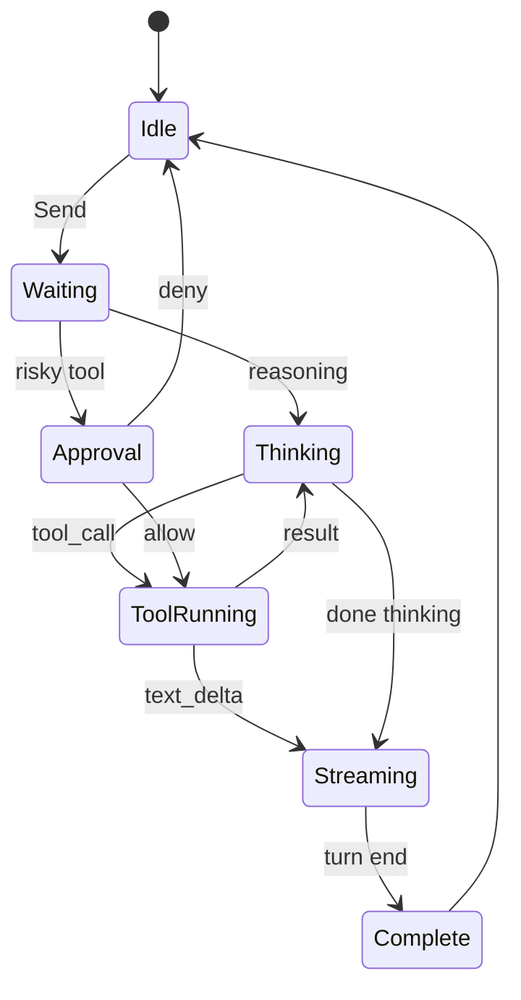
````

#### Contoh — Tool loop sequence

````markdown
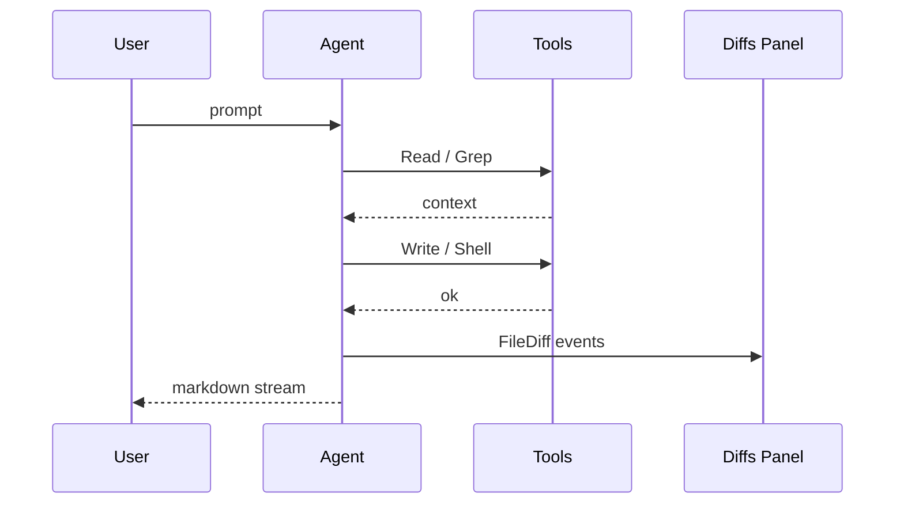
````

#### Contoh — Arsitektur modul (flowchart)

````markdown
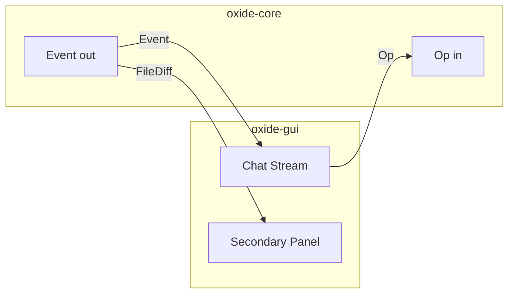
````

#### Spesifikasi visual Mermaid di Cursor

| Property | Nilai |
|----------|-------|
| Container | `.agent-md pre code.language-mermaid` → div `.mermaid` |
| Theme | Dark: bg transparent, node fill `fillSecondary` |
| Node border | `strokeSecondary` 1px |
| Node text | `foreground` 14px |
| Edge / arrow | `foregroundTertiary` |
| Active/highlight | `accent` `#599CE7` |
| Padding | 16px vertical, full width max 720px |
| Enter animation | Same `synara-msg-in` 220ms saat block selesai |
| Live stream | **Tunggu fence close** — tidak render partial mermaid |
| Scroll | Horizontal scroll jika diagram lebar; vertical dalam chat |
| Zoom | Tidak default — user buka Canvas jika perlu zoom |

#### ASCII diagram (alternatif ringan)

Saat diagram kecil, agent pakai preformatted ASCII — render instant, no JS:

```
User ──► Agent ──► Tools ──► Diffs
              └──► Stream ──► Chat
```

| ASCII vs Mermaid | Pilih ASCII | Pilih Mermaid |
|------------------|-------------|---------------|
| Node count | ≤6 | >6 |
| Interactivity | Tidak perlu | Tidak perlu |
| Live stream | Bisa partial OK | Harus fence lengkap |
| Complexity | Linear | Branching / parallel |

---

### 19.3 Saluran 2 — Canvas Panel (diagram interaktif)

Canvas = file `.canvas.tsx` di panel kanan. Bukan markdown — **React + token Cursor**.

#### Komponen diagram yang tersedia (`cursor/canvas`)

| Komponen | Visual | Data input |
|----------|--------|------------|
| `computeDAGLayout` + SVG | Flowchart/DAG terarah | `nodes[]`, `edges[]` |
| `BarChart` / `LineChart` / `PieChart` | Metrik, usage | `series[]` |
| `Table` | Tabular findings | `columns`, `rows` |
| `TodoList` / `TodoListCard` | Task flow checklist | `todos[]` status |
| `DiffView` | Perubahan kode visual | `lines[]` |
| `CollapsibleSection` | Section bertingkat | children |
| `Callout` | Highlight finding | tone: info/warn/error |

#### Contoh DAG di Canvas (architecture)

```tsx
import { computeDAGLayout, useHostTheme, Stack, Card, CardHeader, CardBody, Text } from "cursor/canvas";

const nodes = [
  { id: "user" }, { id: "agent" }, { id: "tools" }, { id: "ui" },
];
const edges = [
  { from: "user", to: "agent" },
  { from: "agent", to: "tools" },
  { from: "tools", to: "agent" },
  { from: "agent", to: "ui" },
];
const layout = computeDAGLayout({ nodes, edges, direction: "vertical" });
// Render SVG rects + paths dari layout.nodes / layout.edges
```

#### Kapan agent buka Canvas vs Mermaid chat

| Kriteria | Chat Mermaid | Canvas |
|----------|----------------|--------|
| User minta "jelaskan alur" | ✅ | ❌ |
| User minta "audit / investigasi" | ❌ | ✅ |
| Data >20 baris tabel | ❌ | ✅ |
| Perlu klik / filter | ❌ | ✅ |
| Bagian dari jawaban singkat | ✅ | ❌ |
| Chart dengan legend + axis | ❌ | ✅ |

**Animasi Canvas:** fade-in panel 200ms (§6.4-N); isi diagram **tanpa** entrance per-node (terlalu busy).

---

### 19.4 Saluran 3 — Implicit Flow (timeline eksekusi)

Ini yang paling sering dilihat user — **bukan** Mermaid, tapi urutan komponen chat yang membentuk "diagram waktu".

#### Vertical timeline agent (urutan DOM)

```
     waktu ─────────────────────────────────────────────►

     ┌─ USER ─────────────────────────────────────┐
     │  perbaiki bug login                         │
     └─────────────────────────────────────────────┘
                         │
                         ▼
     ┌─ WAITING ─ shimmer / typing dots ──────────┐
     └─────────────────────────────────────────────┘
                         │
                         ▼
     ┌─ TOOLS (collapsed) ────────────────────────┐
     │  ▸ Read 2 · Grep 1 · Shell 1               │
     │    ├─ ✓ Read lib.rs                         │  ← expand
     │    ├─ ✓ Grep "session"                      │
     │    └─ ⟳ Shell cargo test                    │  ← running shimmer
     └─────────────────────────────────────────────┘
                         │
                         ▼
     ┌─ THINKING (optional) ──────────────────────┐
     │  💭 Thinking [collapsed]                    │
     └─────────────────────────────────────────────┘
                         │
                         ▼
     ┌─ STATUS PILL ──────────────────────────────┐
     │  ⟳ Planning next moves                      │
     └─────────────────────────────────────────────┘
                         │
                         ▼
     ┌─ STREAM ───────────────────────────────────┐
     │  Saya menemukan masalah di middleware... ▍  │
     └─────────────────────────────────────────────┘
                         │
                         ▼
     ┌─ DIFFS ────────────────────────────────────┐
     │  ▸ M src/middleware.rs  +2 −1               │
     └─────────────────────────────────────────────┘
```

#### Visual connector (opsional — Oxide bisa tambah)

Cursor asli **tidak** menarik garis vertikal antar blok — hierarchy lewat **spacing** (20px margin per `.row`).

Oxide bisa tambah timeline subtle tanpa melanggar Cursor clean:

```css
/* opsional: timeline rail kiri */
.col.streaming .row.activity,
.col.streaming .row.diffrow,
.col.streaming .row.agent {
  position: relative;
  padding-left: 14px;
}
.col.streaming .row::before {
  content: "";
  position: absolute;
  left: 3px;
  top: 0;
  bottom: -20px;
  width: 1px;
  background: color-mix(in srgb, var(--text) 8%, transparent);
}
.col.streaming .row:last-child::before { bottom: 50%; }
```

#### Todo inline flow (task checklist)

Cursor agent bisa emit todo list dalam chat (atau Canvas `TodoListCard`):

| Status | Icon | Color |
|--------|------|-------|
| `pending` | ○ hollow | `foregroundTertiary` |
| `in_progress` | ◐ half | `accent` + shimmer verb |
| `completed` | ✓ | `category.green` |
| `cancelled` | ⊘ | `foregroundQuaternary` |

```
☑ Read auth module
◐ Fix session middleware    ← shimmer saat in_progress
○ Add test
```

Oxide: belum ada `todo-card` native di event loop — bisa map dari engine atau render markdown tasklist (`- [ ]` sudah didukung `md_to_html` via `ENABLE_TASKLISTS`).

---

### 19.5 Diagram State — Panel & Mode (referensi visual)

Diagram ini cocok di **dokumen** dan bisa agent tampilkan via Mermaid saat user tanya layout:

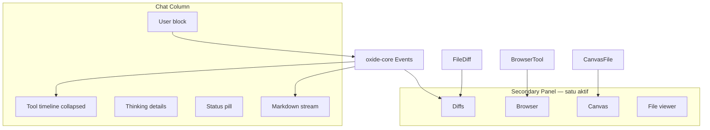

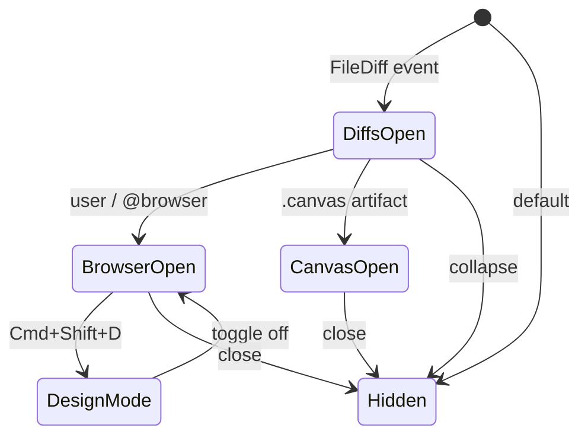

---

### 19.6 Menampilkan Diagram di Dokumen `.md` (seperti file ini)

Dokumen referensi ini sendiri memakai **Mermaid fenced blocks** — renderer Markdown (GitHub, Cursor preview, VS Code) yang support Mermaid akan menampilkan SVG.

| Format | Support | Best for |
|--------|---------|----------|
| ` ```mermaid ` | GitHub, Cursor, many MD viewers | Flow kompleks |
| ASCII box | Universal | Quick ref, terminal |
| Markdown table | Universal | Mapping, checklist |
| ` ``` ` tree indent | Universal | File structure |

**Konvensi dokumen Oxide/Cursor:**

1. Satu diagram = satu ide — jangan 3 diagram kecil jadi satu
2. `flowchart TB` untuk hierarchy UI; `LR` untuk data pipeline
3. `stateDiagram-v2` untuk lifecycle agent / panel
4. `sequenceDiagram` untuk event Op/Event
5. Label node pakai bahasa user (Indonesia/English konsisten per dokumen)
6. Setelah diagram, 1 paragraf penjelasan — jangan diagram tanpa konteks

---

### 19.7 Oxide — Implementasi Menampilkan Alur & Diagram

#### Status saat ini

| Fitur | Oxide | Cursor target |
|-------|-------|---------------|
| Markdown tables | ✅ pulldown-cmark | ✅ |
| Task lists `- [ ]` | ✅ `ENABLE_TASKLISTS` | ✅ |
| Syntax highlight code | ✅ syntect | ✅ |
| Mermaid di chat | ❌ render as code block | ✅ SVG |
| ASCII pre | ✅ plain text | ✅ |
| Canvas panel | ❌ | ✅ |
| Tool timeline | ⚠ per-card, no group | ✅ collapsed group |
| Kanban board | ✅ `board.rs` terpisah | Cloud sidebar |
| Implicit status flow | ✅ status-pill + activity | ✅ |

#### Phase E — Mermaid di chat (Dioxus)

**Opsi A — WebView eval (cepat):**

Setelah `md_to_html`, deteksi `<pre><code class="hl">` dengan lang mermaid → inject div + `mermaid.run()`.

```rust
// Pseudocode di md_to_html / post-process
if lang == "mermaid" && !live {
    return format!(r#"<div class="mermaid-diagram" data-src="{escaped}"></div>"#);
}
// document::eval setelah render:
// mermaid.initialize({ theme: 'dark', themeVariables: { primaryColor: '#181818', ... }})
```

**CSS container:**

```css
.mermaid-diagram {
  margin: 12px 0;
  padding: 16px;
  max-width: 720px;
  overflow-x: auto;
  background: color-mix(in srgb, var(--text) 4%, transparent);
  border-radius: 8px;
  animation: synara-msg-in .22s cubic-bezier(.22,1,.36,1);
}
.mermaid-diagram svg {
  max-width: 100%;
  height: auto;
}
.mermaid-diagram .node rect {
  fill: color-mix(in srgb, var(--text) 6%, transparent);
  stroke: color-mix(in srgb, var(--text) 12%, transparent);
}
```

**Opsi B — Rust native (berat):** crate `mermaid` atau pre-render SVG di build — skip untuk v1.

#### Phase F — Tool timeline sebagai diagram

Tanpa Mermaid — cukup markup grouped (§18.4):

```
▸ 3 tools
  ├─ ✓ Read lib.rs
  ├─ ⟳ Grep "session"     ← shimmer
  └─ ○ Shell pending
```

CSS tree connector:

```css
.act-group.open .activity-card::before {
  content: "";
  position: absolute;
  left: -10px;
  top: 50%;
  width: 6px;
  height: 1px;
  background: color-mix(in srgb, var(--text) 15%, transparent);
}
```

#### Phase G — Diagram panel (Canvas-like, future)

Panel kanan Oxide sekarang: files, preview, inspector. Untuk parity Canvas:

| Step | Work |
|------|------|
| 1 | Engine emit `Event::CanvasArtifact { html atau json spec }` |
| 2 | GUI buka panel kanan mode `diagram` |
| 3 | Render DAG dengan layout manual atau embed lightweight SVG |
| 4 | Token warna dari `--syn-accent`, same as chat |

Prioritas rendah — Mermaid di chat + tool timeline menutup 90% kebutuhan.

#### Mapping Event → visual flow (Oxide)

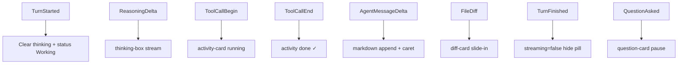

---

### 19.8 Katalog Diagram Siap Pakai untuk Agent Oxide

Agent Oxide bisa menyertakan diagram berikut saat menjelaskan diri sendiri ke user:

#### Op/Event loop

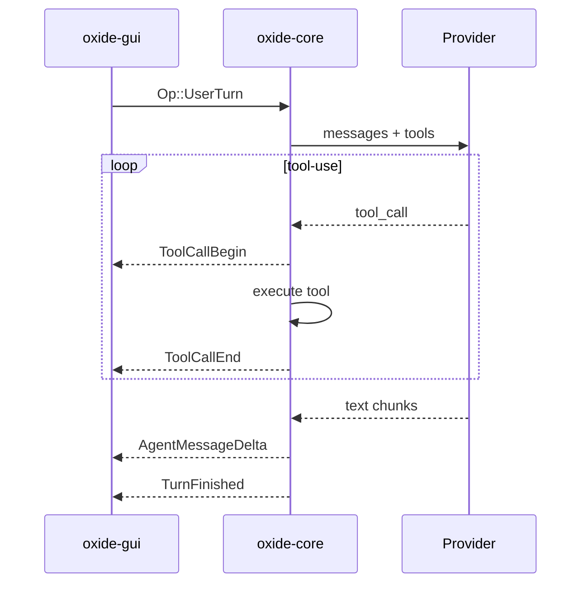

#### Shimmer decision tree

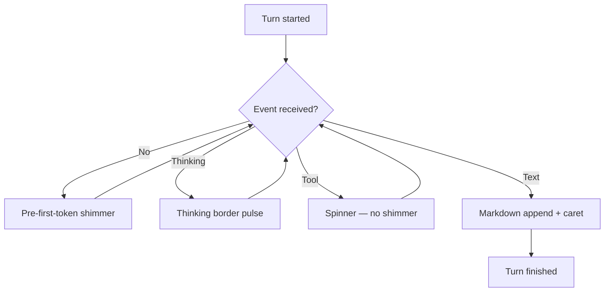

#### Oxide vs Cursor diagram channels

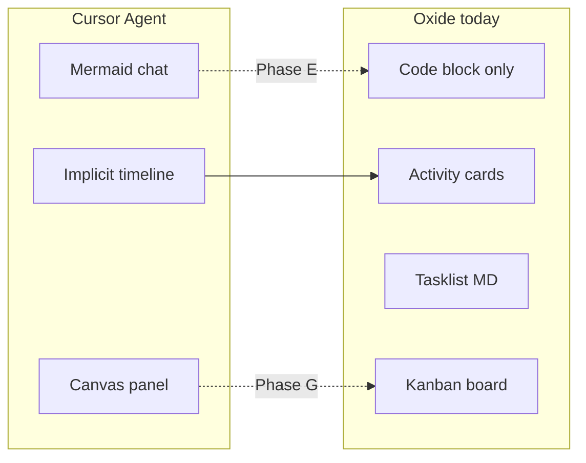

---

### 19.9 Checklist — Diagram & Flow

**Cursor parity:**

- [ ] Mermaid render di chat setelah fence close
- [ ] Mermaid theme dark pakai token `#599CE7` / `#181818`
- [ ] ASCII / table untuk diagram kecil
- [ ] Tool timeline collapsed = diagram waktu implisit
- [ ] Canvas untuk deliverable data-heavy (optional)
- [ ] Tasklist markdown `- [x]` dengan status icon
- [ ] Tidak render mermaid partial saat stream `live=true`
- [ ] Horizontal scroll diagram lebar
- [ ] `prefers-reduced-motion` pada diagram enter animation
- [ ] Satu secondary panel aktif (state diagram §19.5)

**Dokumen `.md`:**

- [ ] Satu diagram per konsep
- [ ] Mermaid + paragraf penjelasan
- [ ] Daftar isi link ke § diagram
- [ ] Changelog update saat diagram berubah

---

## 20. Sidebar Kiri — Fungsi, Desain & Interaksi

> Sidebar kiri adalah **pusat orchestration** di Cursor 3 Agents Window — bukan file tree.
> Di sinilah user melihat semua agent (local, cloud, eksternal), memilih sesi, dan mengelola workspace.

### 20.1 Peran & Filosofi

| IDE klasik (kiri) | Agents Window (kiri) |
|-------------------|----------------------|
| File tree | **Agent / session list** |
| Folder expand/collapse | Workspace group + agent rows |
| File click → buka editor | Agent click → buka tab chat |
| Satu workspace | **Multi-workspace** dalam satu sidebar |
| SCM badge | Status dot + env badge + diff stats |

Sidebar = **dashboard armada agent**. User scan status tanpa membuka tiap chat.

```
┌──────────────────────────────────────────────────────────────┐
│  SIDEBAR KIRI (240–280px)          │  MAIN (chat tabs)       │
│  ─────────────────────────         │  ─────────────────      │
│  [Chrome] New · Search             │                         │
│  [Filter] All · Local · Cloud      │   Active agent chat     │
│  ─────────────────────────         │                         │
│  ▼ Running (3)                     │                         │
│    ● fix-auth        local         │                         │
│    ● add-tests       cloud [thumb] │                         │
│    ○ review-pr       slack         │                         │
│  ▼ Idle (2)                        │                         │
│  ▼ Archived                        │                         │
│  ─────────────────────────         │                         │
│  [Footer] Settings · Marketplace   │                         │
└──────────────────────────────────────────────────────────────┘
```

---

### 20.2 Anatomi Zona (top → bottom)

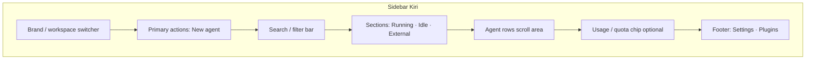

| Zona | Tinggi | Fungsi |
|------|--------|--------|
| **Brand** | 40–48px | Logo, app name, collapse toggle |
| **Actions** | auto | New agent (`Cmd+T`), search sessions |
| **Filter** | 32px | All / Local / Cloud / Waiting approval |
| **Section headers** | 28px | Label + count: "Running (3)" |
| **Scroll list** | `flex: 1` | Agent rows — konten utama |
| **Usage chip** | auto | Quota subscription (opsional) |
| **Footer** | 44px | Settings, marketplace, account |

**Padding:** 8–12px horizontal; section gap 14px (`section-label` margin-top).

---

### 20.3 Agent Row — Struktur Visual

Satu baris agent = **2 lapisan** (title + meta), bukan preview chat.

```
┌─────────────────────────────────────────┐
│ ● fix-auth-bug              [local]     │  ← baris 1: status + nama + badge
│   oxide · 2m · +4 −1                    │  ← baris 2: repo · time · diff stats
│   [optional 48×36 thumbnail]            │  ← cloud only
└─────────────────────────────────────────┘
```

#### Elemen per field

| Elemen | Size | Font | Color |
|--------|------|------|-------|
| Status dot | 6–8px circle | — | state color |
| Title | 13–14px | 400–500 | `foreground` active / `foregroundSecondary` idle |
| Env badge | 10px uppercase | 600 | pill `fillTertiary` |
| Meta line | 11–12px | 400 | `foregroundTertiary` |
| Thumbnail | 48×36px | — | `fillQuaternary` placeholder → image |
| Provider icon | 14–15px | — | optional, tab level |

#### Row dimensions

| Mode | Width | Height | Padding |
|------|-------|--------|---------|
| Expanded sidebar | 240–280px | 44–56px (1–2 baris) | 8px 10px |
| Compact density | 240px | 36–40px | 4px 8px |
| Collapsed rail | 56px | 40px icon only | 8px 0 |

---

### 20.4 Status & Badge System

#### Status dot

| State | Warna | Motion |
|-------|-------|--------|
| **Running** | Green `#3FA266` | Pulse opacity 1↔0.5, 2s loop |
| **Waiting approval** | Yellow `#F1B467` | Pulse 1.5s |
| **Idle / complete** | Gray @54% | Static |
| **Error** | Orange `#D08770` | Static |
| **Cloud syncing** | Blue `#7BAFE9` | Pulse subtle |

#### Environment badge

| Badge | Arti | Warna teks |
|-------|------|------------|
| `local` | Agent di mesin user | `foregroundTertiary` |
| `cloud` | VM Cursor | Blue category |
| `ssh` | Remote server | Purple |
| `slack` | Trigger dari Slack | Pink |
| `github` | PR/issue trigger | Gray + icon |
| `linear` | Task trigger | Purple |

Badge = pill kanan, `border-radius: sm`, padding 2px 6px.

#### Meta line format

```
{repo-name} · {relative-time} · {optional diff stats}
```

Contoh: `oxide · 2m · +12 −3`

Diff stats: hijau `+N`, merah `−M`, mono 11px.

---

### 20.5 Pengelompokan (Grouping)

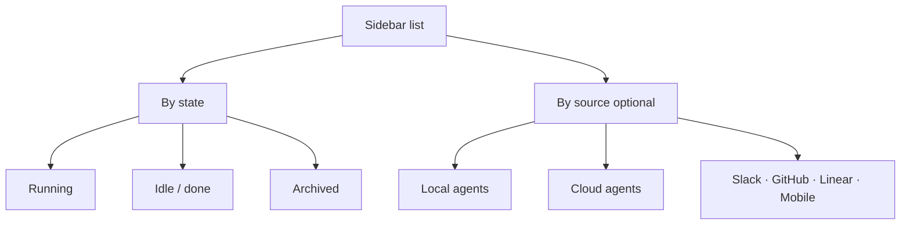

| Mode grup | Default | Toggle |
|-----------|---------|--------|
| By workspace | ✅ multi-repo | Section per repo name |
| By state | ✅ | Running pinned top |
| By timeframe | Optional | Today / This week |
| By source | Filter | All / Local / Cloud |

---

### 20.6 Fungsi & Interaksi

#### Aksi primer

| Aksi | Trigger | Hasil |
|------|---------|-------|
| **Select agent** | Single click row | Tab chat aktif, highlight 150ms |
| **New agent** | `Cmd+T` / New button | Tab kosong + input focus |
| **Search** | `Cmd+K` / search field | Filter rows by title/repo |
| **Handoff** | Context menu | Local ↔ Cloud, 400ms badge crossfade |
| **Open in editor** | Context menu | Buka file di Editor Window |

#### Context menu (right-click)

| Item | Fungsi |
|------|--------|
| Rename | Inline edit title |
| Pin | Pin ke section "Pinned" |
| Mark done / Archive | Pindah ke Archived |
| Move to cloud / local | Handoff session |
| Delete | Hapus sesi + konfirmasi |

#### Hover actions

```
[pin] [archive] [delete]     ← opacity 0 → 1, 120ms
fix-auth-bug           2m
```

Relative time fade out saat hover — Oxide sudah punya pola ini.

#### Keyboard

| Shortcut | Aksi |
|----------|------|
| `↑` / `↓` | Navigate rows |
| `Enter` | Open selected |
| `Cmd+T` | New agent |
| `Cmd+W` | Close tab |
| `F2` | Rename |

---

### 20.7 State Visual Row

| State | Background | Border-left | Title |
|-------|------------|-------------|-------|
| Default | transparent | — | `foregroundSecondary` |
| Hover | `fillPrimary` 19% | — | `foreground` |
| Selected | `fillSecondary` 12% | 2px `accent` | `foreground` |
| Running + selected | `fillSecondary` | 2px `accent` | + green dot pulse |
| Approval | `fillTertiary` | 2px yellow | `foreground` |

---

### 20.8 Collapsed Icon Rail (56px)

| Property | Nilai |
|----------|-------|
| Width transition | 180ms `ease` |
| Label fade | opacity 0, 140ms |
| Projects list | hidden |
| Tooltip | `title` on icon hover |

Oxide: `.sidebar.collapsed` — **sudah ada** di `style.css`.

---

### 20.9 Cloud Row — Thumbnail

| Elemen | Spec |
|--------|------|
| Thumbnail | 48×36, fade-in 200ms |
| Placeholder shimmer | 1.5s sweep |
| Summary toggle | Settings — hide diff di sidebar eksternal |

---

### 20.10 Animasi Sidebar

| Event | Duration |
|-------|----------|
| Row hover | 120–150ms |
| Row select | 150ms ease-out |
| Status pulse | 2s ∞ |
| Sidebar collapse | 180ms |
| New row stagger | 150ms + 30ms |
| Thumbnail fade-in | 200ms |

---

### 20.11 Oxide — Mapping Sidebar Saat Ini

```
Brand (logo → collapse)
Nav: New chat · Search · MCP · Skills · Board
Pinned sessions
Projects (grouped)
  ▼ oxide (current) → active tabs + past sessions
  ▼ other projects
Usage chip (ChatGPT)
Settings
```

| Fungsi Cursor | Oxide | Status |
|---------------|-------|--------|
| New agent | New chat | ✅ |
| Agent list | Project → threads | ✅ beda struktur |
| Multi-workspace | Projects list | ✅ |
| Status running | `syn-spinner` | ✅ |
| Pin / archive / delete | row actions | ✅ |
| Rename | double-click | ✅ |
| Collapsed rail | `.sidebar.collapsed` | ✅ |
| Relative time | `thread-time` | ✅ |
| Cloud thumbnail | — | ❌ |
| Env badge local/cloud | provider icon only | ⚠️ |
| Diff stats di row | — | ❌ |
| Group Running/Idle | by project only | ❌ |
| Handoff cloud | — | ❌ |
| MCP / Skills / Board | — | ✅ Oxide extra |

**Perbedaan utama:** Cursor = **flat agent list** cross-repo; Oxide = **hierarchical project → thread**.

---

### 20.12 Oxide Roadmap Sidebar

| Phase | Work |
|-------|------|
| **H** | CSS: `--sidebar: #141414`, active `border-left` accent |
| **I** | Meta line `project · time · +N −M` |
| **J** | Toggle flat agent list vs project group |
| **K** | Cloud row + filter bar (future) |

---

### 20.13 Diagram — Sidebar ↔ Main

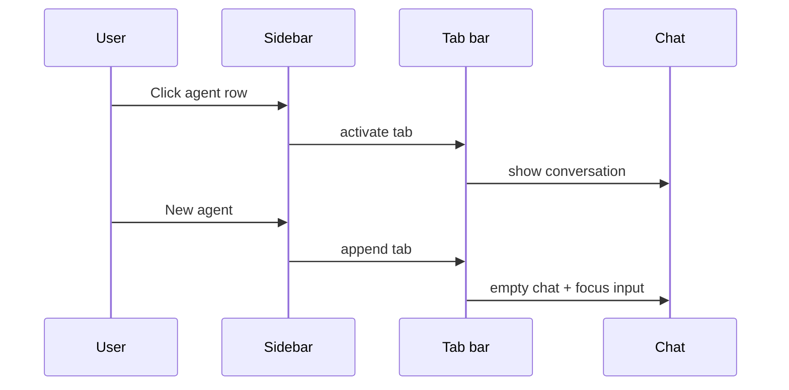

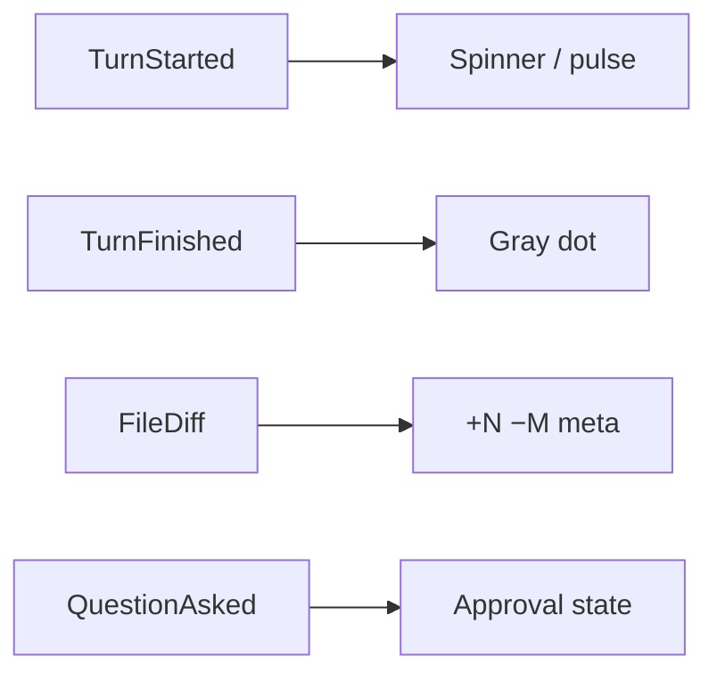

---

### 20.14 Checklist Sidebar

**Cursor:** width 240–280, agent row 2-line, status dot, env badge, sections Running/Idle, filter, context menu, collapsed rail, `prefers-reduced-motion`.

**Oxide:** accent hex, border-left active, meta diff stats, status dot, flat list mode (optional).

---

## 16. Referensi

| Sumber | URL / Path |
|--------|------------|
| Launch blog | https://cursor.com/blog/cursor-3 |
| Agents Window docs | https://cursor.com/docs/agent/agents-window |
| Browser & Design sidebar | https://cursor.com/docs/agent/tools/browser |
| PR Page & Bugbot | https://cursor.com/docs/cursor-review/pr-page |
| Cloud agent settings | https://cursor.com/docs/cloud-agent/settings |
| Cursor SDK (TypeScript) | https://cursor.com/docs/sdk/typescript |
| Cursor SDK (Python) | https://cursor.com/docs/sdk/python |
| Glass landing | https://cursor.com/en-US/glass |
| Design tokens (canvas SDK) | `~/.cursor/skills-cursor/canvas/sdk/canvas-tokens.d.ts` |
| Canvas DAG layout | `~/.cursor/skills-cursor/canvas/sdk/dag-layout.d.ts` |
| Canvas charts / TodoList | `~/.cursor/skills-cursor/canvas/sdk/index.d.ts` |
| Typography & spacing | `~/.cursor/skills-cursor/canvas/sdk/theme.d.ts` |
| UI primitives | `~/.cursor/skills-cursor/canvas/sdk/ui-primitives.d.ts` |
| Mermaid.js | https://mermaid.js.org |
| Skills (automate, hooks, canvas) | `~/.cursor/skills-cursor/*/SKILL.md` |
| Oxide GUI chat loop | `crates/oxide-gui/src/lib.rs` |
| Oxide GUI styles | `crates/oxide-gui/assets/style.css` |
| **Chat sesi & restore** | [cursor-agent-chat-sessions.md](./cursor-agent-chat-sessions.md) |

---

## Changelog Dokumen

| Versi | Perubahan |
|-------|-----------|
| 1.0 | Desain tampilan, tokens, komponen, animasi |
| 1.1 | + Fitur lengkap, arsitektur informasi, alur UX, panduan workflow, orkestrasi agent |
| 1.2 | + §5.9 Agent stream, shimmer, lifecycle — fokus agent-only |
| 1.3 | + §17 Agent internal UI anatomy, §18 Oxide parity guide |
| 1.4 | + §19 Alur & diagram — Mermaid, Canvas, implicit timeline, Oxide Phase E–G |
| 1.5 | + §20 Sidebar kiri — fungsi, desain, interaksi, Oxide mapping |

---

*Dokumen ini dibuat sebagai referensi desain internal. Nilai animasi (§6) dan density modes (§8.4) bersifat inferensi dari pola produk; update jika Cursor mempublikasikan spec resmi.*
