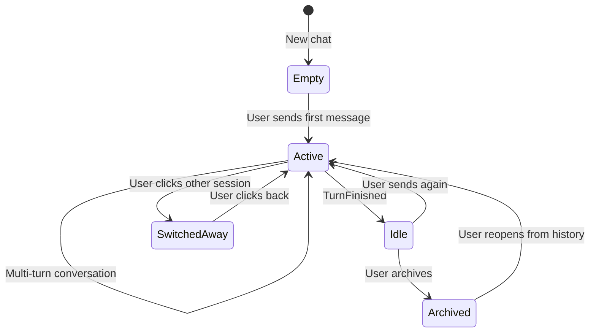
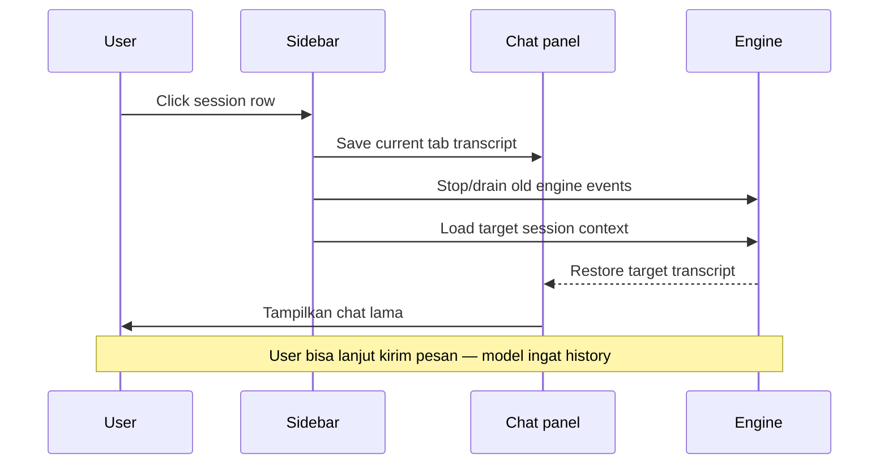
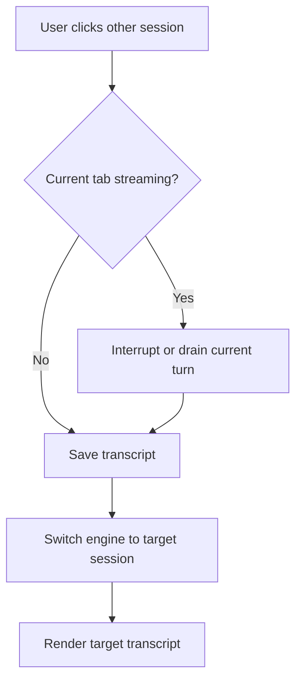
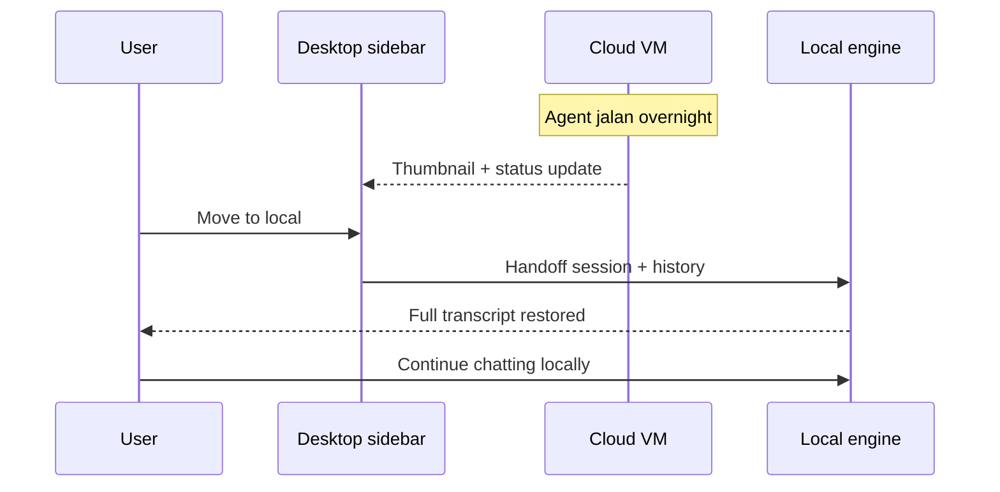
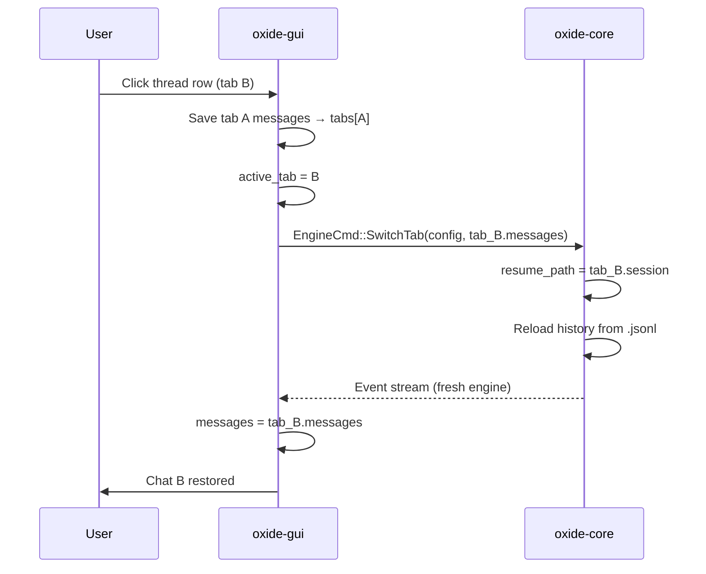
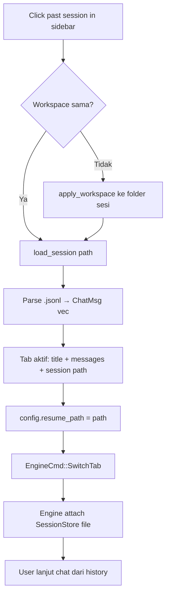
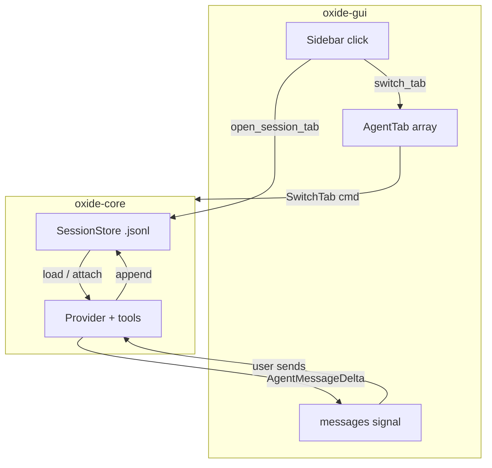

# Cara Kerja Chat Agent — Klik, Sesi & Restore

> Dokumen ini menjelaskan **bagaimana chat agent bekerja** dari sudut pandang operasi:
> apa yang terjadi saat kamu klik sesi di sidebar, bagaimana percakapan disimpan,
> dan bagaimana **kembali ke chat sebelumnya** tanpa kehilangan konteks.
>
> Mencakup: **Cursor 3 Agents Window** (referensi) + **Oxide** (implementasi nyata di repo ini).

---

## Daftar isi

1. [Konsep dasar](#1-konsep-dasar)
2. [Anatomi satu sesi chat](#2-anatomi-satu-sesi-chat)
3. [Alur klik — diagram](#3-alur-klik--diagram)
4. [Cursor: cara kerja chat & restore](#4-cursor-cara-kerja-chat--restore)
5. [Oxide: cara kerja chat & restore](#5-oxide-cara-kerja-chat--restore)
6. [Perbandingan Cursor vs Oxide](#6-perbandingan-cursor-vs-oxide)
7. [Skenario praktis](#7-skenario-praktis)
8. [Troubleshooting](#8-troubleshooting)

---

## 1. Konsep dasar

Chat agent **bukan** satu obrolan panjang tanpa batas. Ia terdiri dari **sesi-sesi terpisah**, masing-masing punya:

| Unsur | Fungsi |
|-------|--------|
| **Transcript (UI)** | Apa yang kamu lihat di panel chat — bubble user, agent, tools, diff |
| **Model context (engine)** | Riwayat pesan yang dikirim ke LLM saat turn berikutnya |
| **Session file / ID** | Penyimpanan persisten agar bisa dibuka lagi setelah restart |
| **Tab / row sidebar** | Pointer UI — klik = pindah ke sesi itu |

```
┌──────────────┐     ┌──────────────┐     ┌──────────────┐
│   Sidebar    │     │  Chat panel  │     │    Engine    │
│  (daftar)    │────►│  (transcript)│◄───►│  (LLM+tools) │
└──────────────┘     └──────────────┘     └──────────────┘
       │                     │                     │
       └─────────────────────┴─────────────────────┘
                    satu "sesi" = satu thread
```

**Prinsip penting:** klik sesi lain = **swap** transcript + engine context ke sesi target. Sesi yang kamu tinggalkan **disimpan dulu**, bukan dibuang.

---

## 2. Anatomi satu sesi chat

### 2.1 Lifecycle sesi



### 2.2 Isi yang dipertahankan saat pindah sesi

| Data | Disimpan? | Keterangan |
|------|-----------|------------|
| Pesan user & agent | ✅ | Transcript penuh |
| Tool call history (engine) | ✅ | Untuk lanjut turn |
| Thinking buffer (UI) | ❌ | Direset per turn |
| Streaming state | ❌ | Di-stop saat switch |
| Approval pending | ❌ | Dibersihkan saat switch |
| File diff cards | ⚠️ | Oxide: dari transcript; Cursor: dari git state |
| Scroll position | ⚠️ | Biasanya jump ke bottom |

---

## 3. Alur klik — diagram

### 3.1 Klik baris di sidebar (umum)



### 3.2 Klik vs double-click vs right-click

| Gesture | Cursor (Agents Window) | Oxide (sidebar) |
|---------|------------------------|-----------------|
| **Single click** | Buka / fokus agent tab | Buka sesi di tab aktif |
| **Double click** | Rename agent | Rename tab title |
| **Right click** | Context menu (pin, archive, delete, handoff) | Context menu (archive, delete) |
| **Click project header** | Switch workspace (multi-repo) | Switch workspace folder |
| **Click + (new)** | Tab agent baru | New chat / new tab |

### 3.3 Klik saat agent sedang streaming



**Cursor:** switch tab bisa interrupt turn aktif (Stop otomatis atau lanjut di background — tergantung tab).

**Oxide:** `SwitchTab` mengosongkan `streaming`, drain event queue, lalu restore transcript target.

---

## 4. Cursor: cara kerja chat & restore

### 4.1 Model mental

Cursor 3 Agents Window memisahkan:

| Lapisan | Penyimpanan |
|---------|-------------|
| **Agent row (sidebar)** | Metadata: nama, status, local/cloud, repo |
| **Agent tab (main)** | Transcript + input state |
| **Cloud session** | VM Cursor — history sync ke cursor.com/agents |
| **Local session** | Disk + engine di mesin user |

Semua agent (local, cloud, Slack, GitHub, mobile) muncul di **satu sidebar**.

### 4.2 Klik sesi di sidebar Cursor

1. Row di-highlight (150ms, border-left accent)
2. Tab chat corresponding aktif di main panel
3. Transcript dimuat dari session store
4. Engine reconnect ke context sesi itu
5. Kamu bisa langsung kirim follow-up — model punya full history

### 4.3 Restore chat sebelumnya

| Cara | Langkah |
|------|---------|
| **Sidebar** | Klik row agent / session lama |
| **Agent tabs** | Klik tab yang masih terbuka |
| **Cmd+[** / **Cmd+]** | Previous / next tab |
| **Cloud handoff** | Move to local → history ikut pindah |
| **Cross-device** | Buka sesi yang sama di mobile/web → muncul di sidebar desktop |

**Yang di-restore:**
- Full conversation history
- Model context untuk turn lanjutan
- Associated diffs / PR state (jika ada)

**Yang tidak di-restore:**
- Panel secondary (browser/canvas) — perlu dibuka lagi
- Partial streaming turn — turn terputus harus di-retry

### 4.4 Multi-tab paralel

Cursor 3: agent tab = editor tab. Bisa split/grid.

```
Tab A (fix-auth)     Tab B (add-tests)
     │                    │
     └─ session A         └─ session B
```

Klik tab ≠ klik sidebar — keduanya switch ke sesi yang sama jika tab terikat ke agent row.

### 4.5 Diagram — restore dari cloud



---

## 5. Oxide: cara kerja chat & restore

Oxide punya implementasi konkret di `oxide-gui` + `oxide-core`. Ini alur **nyata** di codebase.

### 5.1 Struktur data

```rust
// crates/oxide-gui/src/lib.rs
struct AgentTab {
    id: u64,
    title: String,
    provider: String,
    model: String,
    messages: Vec<ChatMsg>,      // transcript UI
    session: Option<PathBuf>,    // file .jsonl
}
```

Penyimpanan disk:

```
<workspace>/.oxide/sessions/<timestamp>-<pid>.jsonl
```

Format: **JSONL** — satu baris JSON per pesan:

```json
{"role":"meta","content":"provider=claude","ts_ms":1710000000000}
{"role":"user","content":"perbaiki bug login","ts_ms":1710000001000}
{"role":"assistant","content":"Saya cek middleware...","ts_ms":1710000005000}
```

Engine: `oxide-core` → `SessionStore` (`crates/oxide-core/src/store.rs`).

### 5.2 Dua cara buka chat lama

#### A. Klik tab aktif (thread di project saat ini)

Fungsi: `switch_tab()` — `lib.rs` ~4765



**Langkah internal:**

1. Simpan `messages` tab saat ini ke `tabs[cur].messages`
2. Set `active_tab` ke index target
3. Update config: `provider`, `model`, `resume_path` dari tab target
4. Kirim `EngineCmd::SwitchTab` → restart engine dengan history tab target
5. Drain event queue lama (cegah bleed)
6. Set `messages` = transcript tab target
7. `scroll_chat_bottom()`

#### B. Klik sesi lama di sidebar (past session)

Fungsi: `open_session_tab()` — `lib.rs` ~1319

Perbedaan penting:

| | `switch_tab` | `open_session_tab` |
|---|--------------|-------------------|
| Target | Tab yang sudah ada | File `.jsonl` dari history |
| Tab baru? | Tidak | **Tidak** — navigasi di tab aktif (Synara-style) |
| Workspace | Sama project | **Auto-switch** ke workspace sesi jika beda folder |
| Engine | SwitchTab + resume_path | SwitchTab + `load_session(path)` |



**Derivasi workspace dari path sesi:**

```
/path/to/project/.oxide/sessions/123.jsonl
         ↑ workspace = 3 level naik dari file
```

### 5.3 Kapan session file dibuat?

Lazy — **tidak** saat tab baru dibuka:

1. User kirim **pesan pertama** → engine `SessionStore::open()` atau `attach()`
2. Engine emit `Event::SessionPath { path }`
3. GUI bind `tabs[active].session = path`

```rust
// Event::SessionPath handler — lib.rs ~2241
if let Some(t) = tabs.write().get_mut(cur) {
    t.session = Some(pb);
}
```

Tab baru (`new_agent_tab`) → `session: None` sampai pesan pertama.

### 5.4 New chat vs restore

| Aksi | UI | Engine | Session file |
|------|-----|--------|--------------|
| **New chat** (nav) | Clear messages, tab kosong | `SwitchTab` empty history | Baru saat pesan pertama |
| **+ tab** | Tab baru empty | SwitchTab empty | Baru saat pesan pertama |
| **Click thread** | Load tab.messages | SwitchTab + resume_path | Existing file |
| **Click past session** | load_session → messages | SwitchTab + attach file | Existing file |

### 5.5 Engine resume (oxide-core)

```rust
// config.resume_path menang over config.resume generic
if let Some(p) = config.resume_path.clone() {
    history = SessionStore::load(&p)  // baca .jsonl
}
// attach = lanjut append ke file yang sama, bukan buat baru
SessionStore::attach(p)
```

Saat kamu restore dan kirim pesan baru → **append** ke file `.jsonl` yang sama. Bukan file baru.

### 5.6 Sidebar Oxide — apa yang terjadi saat klik

```
Sidebar
├── Pinned sessions        → open_session_tab(path)
├── Project "oxide" (current)
│   ├── thread tab 1       → switch_tab(0)
│   ├── thread tab 2       → switch_tab(1)
│   └── ...
└── Past sessions          → open_session_tab(path)
    └── "fix login · 2h"
```

**Hover actions** (pin / archive / delete) — `stopPropagation`, tidak trigger navigasi.

### 5.7 Diagram lengkap — Oxide chat lifecycle



---

## 6. Perbandingan Cursor vs Oxide

| Aspek | Cursor 3 | Oxide |
|-------|----------|-------|
| Unit sidebar | Agent row (flat) | Project → thread / past session |
| Klik row | Buka agent tab | `switch_tab` atau `open_session_tab` |
| Tab baru saat klik history | Bisa (tab system) | **Tidak** — navigasi tab aktif |
| Penyimpanan | Cloud + local store | `.oxide/sessions/*.jsonl` |
| Format | Internal Cursor | JSONL per line |
| Multi-workspace | Native sidebar | `apply_workspace` on open_session |
| Cloud restore | Handoff + cursor.com | Belum |
| Bind session to tab | Automatic | `Event::SessionPath` |
| Drain events on switch | Ya | Ya (`while ev_rx.try_recv()`) |
| Pin / archive | Ya | Ya (`pinned_sessions`, archive/) |

---

## 7. Skenario praktis

### Skenario A — Lanjut chat kemarin

**Oxide:**
1. Buka app → workspace `oxide`
2. Sidebar → under project, klik `"fix auth middleware · 1d"`
3. `open_session_tab` loads `.jsonl`
4. Transcript muncul — kirim "lanjutkan, tambah test"
5. Engine append ke **file yang sama**

**Cursor:**
1. Sidebar → klik agent row idle
2. Tab restore — kirim follow-up

### Skenario B — Dua task paralel

**Oxide:**
1. Tab 1: fix bug (streaming)
2. Klik `+` atau new tab → Tab 2: docs
3. `switch_tab` saves Tab 1 messages, engine switches
4. Klik Tab 1 di sidebar → restore Tab 1, lanjut

**Cursor:**
1. Agent tab A + tab B side-by-side
2. Klik sidebar row B → fokus B

### Skenario C — Salah klik, mau balik

```
Tab A (aktif) → klik Tab B → klik Tab A lagi
```

Oxide: `switch_tab` restore dari `tabs[A].messages` — **as long as** Tab A messages tersimpan saat leave (always, line 4777-4778).

Past session: klik lagi row yang sama → `open_session_tab` reload dari disk.

### Skenario D — New chat setelah restore

Nav **New chat**:
- Clear messages
- `Reconfigure` engine (bukan SwitchTab)
- Tab session cleared — file baru saat pesan pertama

Jangan campur dengan restore — New chat = fresh thread.

---

## 8. Troubleshooting

| Gejala | Penyebab mungkin | Solusi |
|--------|------------------|--------|
| Chat lama kosong | File `.jsonl` terhapus / corrupt | Cek `.oxide/sessions/` |
| History tidak lanjut ke model | `resume_path` salah | Pastikan `Event::SessionPath` ter-bind |
| Tab campur isi | SessionPath newest-file guess | Oxide fix: bind exact path per tab |
| Chat muncul di project salah | Buka sesi tanpa switch workspace | `open_session_tab` harus derive workspace |
| Streaming bleed ke tab lain | Event queue tidak di-drain | `SwitchTab` drain `ev_rx` |
| Sesi hilang dari sidebar | Di-archive | Cek `.oxide/sessions/archive/` |
| Title aneh | Belum ada user message | Title dari baris user pertama (38 char) |

---

## Referensi kode (Oxide)

| File | Isi |
|------|-----|
| `crates/oxide-gui/src/lib.rs` | `switch_tab`, `open_session_tab`, `load_session`, event loop |
| `crates/oxide-core/src/store.rs` | `SessionStore` JSONL persistence |
| `crates/oxide-core/src/lib.rs` | Engine resume dari `resume_path` |
| `crates/oxide-protocol/src/lib.rs` | `Event::SessionPath`, `Op::UserTurn` |

## Referensi eksternal (Cursor)

| Sumber | URL |
|--------|-----|
| Agents Window | https://cursor.com/docs/agent/agents-window |
| Cursor 3 launch | https://cursor.com/blog/cursor-3 |
| Desain UI lengkap | [cursor-3-agent-mode-design.md](./cursor-3-agent-mode-design.md) |

---

## Changelog

| Versi | Perubahan |
|-------|-----------|
| 1.0 | Dokumen awal — klik, sesi, restore Cursor + Oxide |
